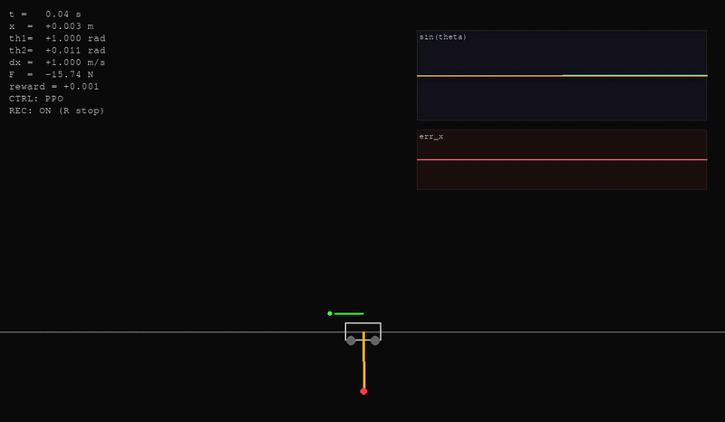

# Управление перевёрнутым маятником

Проект для моделирования и управления тележкой с перевёрнутым маятником. В
состав входят физическая модель на C++, датчики с шумом и квантованием,
Gymnasium-среда, контроллер PPO и GUI на Pygame.

## Демо



## Возможности

- симуляция одно- и двухзвенного маятника;
- физическое ядро на C++ с Python-интерфейсом;
- PPO-обучение через Stable-Baselines3;
- настраиваемые награды, условия завершения и усечения эпизода;
- телеметрия с шумом, разрешением энкодеров и фильтрацией;
- визуализация, ручное управление и запись видео;
- автоматические тесты, Ruff и mypy.

## Структура

- [`packages/simulation/co`](packages/simulation/co) — физика, датчики и конфигурации;
- [`packages/simulation/env`](packages/simulation/env) — Gymnasium-среда;
- [`packages/controllers/base`](packages/controllers/base) — общий интерфейс и функции среды;
- [`packages/controllers/ppo`](packages/controllers/ppo) — PPO-контроллер;
- [`packages/simulation/gui`](packages/simulation/gui) — визуализация;
- [`tests`](tests) — тесты проекта;
- [`PPO_train.py`](PPO_train.py) — запуск обучения;
- [`run_gui.py`](run_gui.py) — запуск GUI.

## Установка

Требуется Python 3.12, Poetry, CMake и C++-компилятор.

```bash
poetry install --no-root
```

## Запуск

Сначала собрать физическое ядро:

```bash
make build
```

Запустить обучение PPO:

```bash
make train
```

Запустить визуализацию:

```bash
make gui
```

## Проверки

```bash
poetry run pytest
poetry run ruff check .
poetry run ruff format --check .
poetry run mypy --explicit-package-bases --ignore-missing-imports .
```

Основные параметры модели, датчиков, контроллера и PPO находятся в
[`configs.py`](configs.py).
