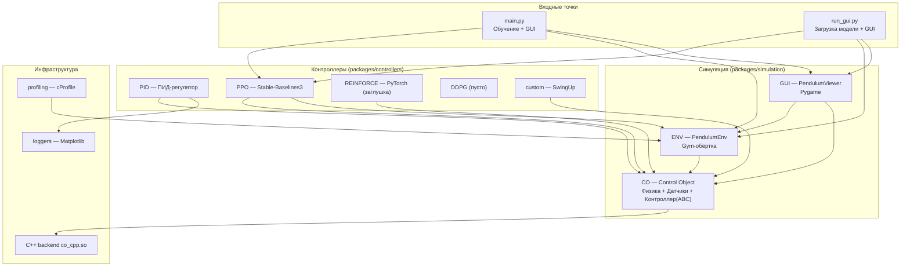
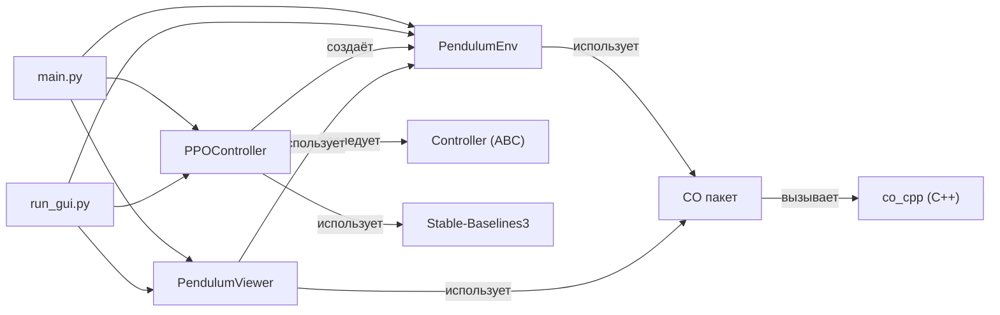
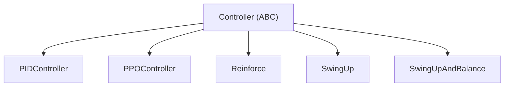
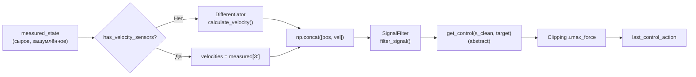
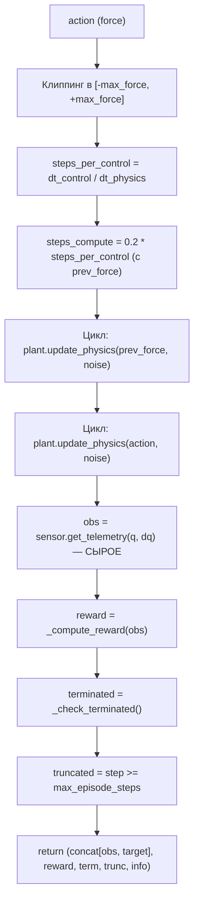
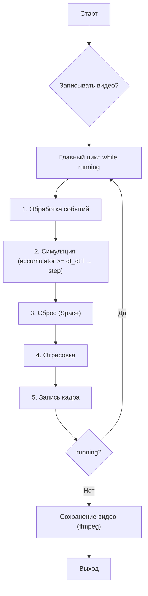
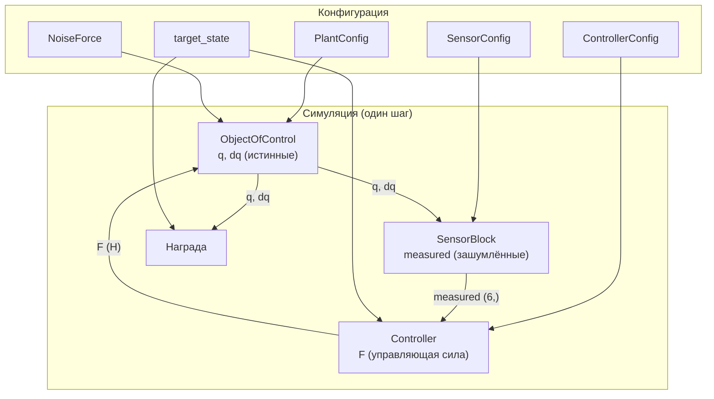
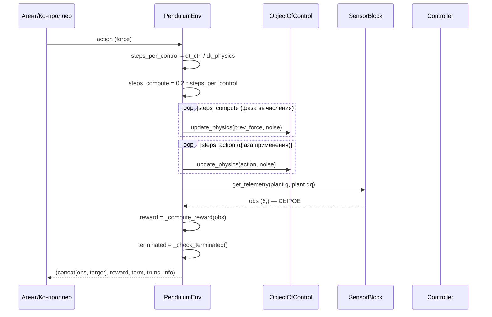
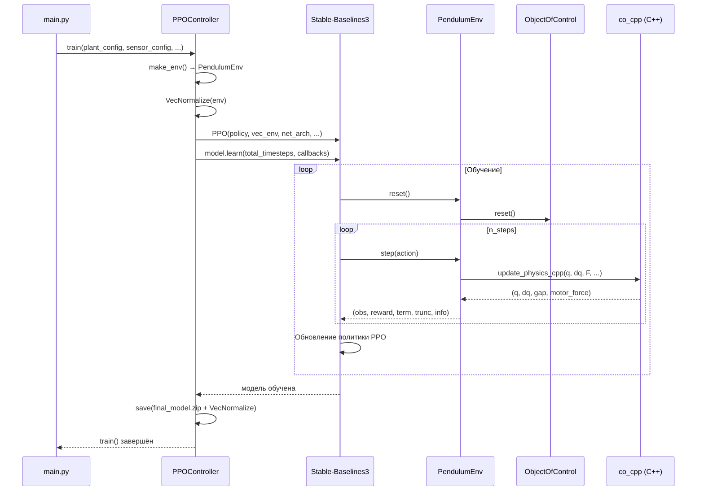

# Техническая документация проекта RL (Inverted Pendulum)

> **Версия документа:** 2.0  
> **Дата:** 2026-08-03  
> **Проект:** `rl` — симуляция и управление перевёрнутым маятником на тележке

---

## Оглавление

- [1. Общая архитектура](#1-общая-архитектура)
- [2. Структура кода](#2-структура-кода)
- [3. Ключевые компоненты](#3-ключевые-компоненты)
- [4. Потоки данных (Data Flow)](#4-потоки-данных-data-flow)
- [5. API и интерфейсы](#5-api-и-интерфейсы)
- [6. Детали реализации](#6-детали-реализации)
- [7. Настройка и запуск](#7-настройка-и-запуск)
- [8. Анализ: сложные места, архитектурные решения, рефакторинг](#8-анализ-сложные-места-архитектурные-решения-рефакторинг)

---

## 1. Общая архитектура

### 1.1 Краткое описание проекта

Проект `rl` — это программный комплекс для моделирования, управления и обучения с подкреплением (Reinforcement Learning) задачи стабилизации перевёрнутого маятника на тележке (cart-pole). Система реализует полный цикл: от физического моделирования динамики (уравнения Лагранжа 2-го рода, интегрируемые методом Рунге–Кутты 4-го порядка) до обучения нейросетевых политик (PPO) и классических регуляторов (PID с генетической оптимизацией).

Проект построен по модульной архитектуре: физическое ядро (`CO` — Control Object) на Python с высокопроизводительным C++ backend через pybind11; среда обучения соответствует интерфейсу Gymnasium; визуализация на Pygame с записью видео через ffmpeg. Контроллеры — подключаемые модули, наследующиеся от абстрактного `Controller` (паттерн Template Method).

### 1.2 Технологический стек

| Категория | Технология | Версия | Назначение |
|---|---|---|---|
| Язык | Python | ^3.12 | Основной язык |
| Язык | C++ | C++17 | Backend физики (RK4) |
| Сборка C++ | CMake | ≥3.20 | Сборка pybind11-модуля |
| Биндинг | pybind11 | ^3.0.4 | Python ↔ C++ |
| Вычисления | NumPy | ^2.4.6 | Векторные операции |
| ML | PyTorch | ^2.13.0 (CPU) | Нейросети |
| RL | Stable-Baselines3 | (через gymnasium) | PPO |
| RL | Gymnasium | ^1.3.0 | Интерфейс среды |
| Визуализация | Pygame | ^2.6.1 | GUI симуляции |
| Графики | Matplotlib | ^3.10.9 | Логирование |
| Научные | SciPy | ^1.17.1 | find_peaks, оптимизация |
| Оптимизация | scikit-optimize | ^0.10.2 | Байесовская оптимизация |
| JIT | Numba | ^0.65.1 | Ускорение (потенциал) |
| Видео | ffmpeg | ^1.4 | Сборка MP4 |
| Трекинг | TensorBoard | ^2.21.0 | Логирование обучения |
| Менеджер пакетов | Poetry | — | Управление зависимостями |

### 1.3 Общая диаграмма компонентов



### 1.4 Основные модули и их назначение

| Модуль | Путь | Назначение |
|---|---|---|
| **CO** | `packages/simulation/CO/` | Ядро симуляции: физика (RK4), датчики, абстрактный контроллер, обработка сигналов |
| **ENV** | `packages/simulation/ENV/` | Gymnasium-обёртка `PendulumEnv` |
| **GUI** | `packages/simulation/GUI/` | Pygame-визуализация, запись видео |
| **PID** | `packages/controllers/PID/` | ПИД-регулятор с оптимизацией (GA) |
| **PPO** | `packages/controllers/PPO/` | PPO-агент на Stable-Baselines3 |
| **REINFORCE** | `packages/controllers/REINFORCE/` | REINFORCE (заглушка) |
| **DDPG** | `packages/controllers/DDPG/` | DDPG (не реализован) |
| **custom** | `packages/controllers/custom/` | SwingUp + балансировка |
| **loggers** | `packages/loggers/` | Matplotlib-логгер |
| **profiling** | `profiling/` | Профилирование (cProfile) |

---

## 2. Структура кода

### 2.1 Дерево файлов и папок

```
RL/
├── main.py                          # Точка входа: обучение PPO + GUI
├── run_gui.py                       # Загрузка модели + GUI (без обучения)
├── pyproject.toml                   # Корневой Poetry-манифест
├── poetry.lock
├── output.gif / output.mp4          # Примеры видео
│
├── packages/
│   ├── simulation/
│   │   ├── CO/                       # Control Object — ядро симуляции
│   │   │   ├── __init__.py           # Публичный API пакета
│   │   │   ├── datatypes.py          # Dataclass-конфигурации
│   │   │   ├── pendulum.py           # ObjectOfControl (физика) + BacklashModel
│   │   │   ├── sensor.py             # SensorBlock (квантование + пул шума)
│   │   │   ├── controller.py         # Controller(ABC) — Template Method
│   │   │   ├── signal_processing.py  # Differentiator + SignalFilter
│   │   │   ├── pyproject.toml
│   │   │   ├── README.md
│   │   │   └── cpp/                  # C++ backend (pybind11)
│   │   │       ├── co_physics.hpp    # Структуры + объявления
│   │   │       ├── co_physics.cpp    # RK4 + уравнения Лагранжа
│   │   │       ├── co_bindings.cpp   # pybind11-обёртки
│   │   │       ├── CMakeLists.txt
│   │   │       └── README.md
│   │   │
│   │   ├── ENV/
│   │   │   ├── __init__.py
│   │   │   ├── env.py                # PendulumEnv(gym.Env)
│   │   │   ├── pyproject.toml
│   │   │   └── README.md
│   │   │
│   │   └── GUI/
│   │       ├── __init__.py           # Экспорт PendulumViewer
│   │       ├── gui.py                # PendulumViewer — главный цикл
│   │       ├── constants.py          # Цвета, размеры, FPS
│   │       ├── draw.py               # Функции отрисовки
│   │       ├── event_controller.py   # EventController
│   │       ├── input_handling.py     # handle_events()
│   │       ├── dialogs.py            # Диалоги
│   │       ├── recorder.py           # compile_video() — ffmpeg
│   │       ├── pyproject.toml
│   │       └── README.md
│   │
│   ├── controllers/
│   │   ├── PID/
│   │   │   ├── __init__.py
│   │   │   ├── pid.py               # PIDController(Controller)
│   │   │   ├── cost_functions.py    # J() — квадратичная стоимость
│   │   │   ├── optimizers.py        # Genetic_PID_AngleOnly
│   │   │   ├── pyproject.toml
│   │   │   └── README.md
│   │   │
│   │   ├── PPO/
│   │   │   ├── __init__.py          # Экспорт PPOConfig, PPOController
│   │   │   ├── ppo.py               # PPOController(Controller)
│   │   │   ├── mode_config.py       # PPOConfig
│   │   │   ├── pyproject.toml
│   │   │   └── README.md
│   │   │
│   │   ├── REINFORCE/
│   │   │   ├── __init__.py          # Экспорт Reinforce, ReinforceNetworkConfig
│   │   │   ├── reinforce.py         # Reinforce(Controller) — заглушки
│   │   │   ├── mode_config.py
│   │   │   ├── pyproject.toml
│   │   │   └── README.md
│   │   │
│   │   ├── DDPG/
│   │   │   ├── __init__.py
│   │   │   ├── ddpg.py              # Пустой (не реализован)
│   │   │   ├── pyproject.toml
│   │   │   └── README.md
│   │   │
│   │   └── custom/
│   │       ├── __init__.py          # Экспорт SwingUp, SwingUpAndBalance
│   │       ├── swing_up_block.py    # SwingUp + SwingUpAndBalance
│   │       ├── pyproject.toml
│   │       └── README.md
│   │
│   └── loggers/
│       ├── __init__.py              # Экспорт Logger
│       ├── loggers.py               # Logger — Matplotlib
│       ├── pyproject.toml
│       └── README.md
│
└── profiling/
    ├── __init__.py
    ├── profiling.py                 # Профилирование PendulumEnv
    ├── profile_reinforce_train.py
    ├── pyproject.toml
    └── README.md
```

### 2.2 Взаимосвязи между модулями



**Ключевые зависимости:**

| Модуль | Зависит от | Тип связи |
|---|---|---|
| `main.py` | `PPOController`, `PendulumEnv`, `PendulumViewer`, `CO` | Импорт + композиция |
| `run_gui.py` | `PPOController`, `PendulumEnv`, `PendulumViewer`, `CO` | Импорт + композиция |
| `PPOController` | `Controller` (наследование), `PendulumEnv`, `stable_baselines3` | Наследование + композиция |
| `PIDController` | `Controller` (наследование), `PendulumEnv`, `cost_functions` | Наследование + вызов |
| `PendulumEnv` | `ObjectOfControl`, `SensorBlock`, `Controller`, `gymnasium` | Композиция + наследование |
| `PendulumViewer` | `PendulumEnv`, `CO`, `pygame` | Композиция |
| `ObjectOfControl` | `co_cpp` (C++ backend), `PlantConfig` | Опциональный C++ |

### 2.3 Входные точки приложения

#### Основная точка входа: [`main.py`](main.py:1)

1. Создаются конфигурации (PlantConfig, SensorConfig, ControllerConfig, NoiseForce)
2. Создаётся `PPOController` (без избыточных параметров)
3. Вызывается `train()` — обучение PPO через SB3 (с `VecNormalize`, `net_arch`, чекпоинтами)
4. Сохраняется модель + `VecNormalize` (`save()`)
5. Создаётся `PendulumEnv` с обученным контроллером
6. Запускается GUI (`PendulumViewer.use()`)

#### Запуск GUI с предобученной моделью: [`run_gui.py`](run_gui.py:1)

1. Загружает модель через `from_pretrained()` (с `VecNormalize`)
2. Создаёт `PendulumEnv`
3. Запускает GUI

#### Дополнительные точки входа:

| Файл | Назначение |
|---|---|
| [`profiling/profiling.py`](profiling/profiling.py:1) | Профилирование `PendulumEnv` |
| [`profiling/profile_reinforce_train.py`](profiling/profile_reinforce_train.py:1) | Профилирование REINFORCE |

### 2.4 Конфигурационные файлы

#### Корневой [`pyproject.toml`](pyproject.toml:1)

Poetry-манифест с зависимостями и локальными подмодулями. Источник PyTorch — один (`pytorch_cpu`).

#### Подмодульные `pyproject.toml`

Каждый пакет имеет собственный `pyproject.toml` для независимой установки.

#### C++ сборка: [`packages/simulation/CO/cpp/CMakeLists.txt`](packages/simulation/CO/cpp/CMakeLists.txt:1)

CMake-конфигурация для сборки pybind11-расширения `co_cpp` (C++17, вывод `co_cpp.so`).

---

## 3. Ключевые компоненты

### 3.1 Пакет CO (Control Object)

#### 3.1.1 `PlantConfig` — конфигурация физической модели

**Файл:** [`packages/simulation/CO/datatypes.py`](packages/simulation/CO/datatypes.py:51)

Dataclass с физическими параметрами тележки с маятником. Вычисляет `L1, L2, J1, J2` (однородный стержень). Методы: `to_dict()`, `copy()`.

| Поле | Тип | По умолч. | Описание |
|---|---|---|---|
| `M` | `float` | `1.0` | Масса тележки (кг) |
| `m1` | `float` | `0.3` | Масса первого звена (кг) |
| `m2` | `float` | `0.0` | Масса второго звена (кг) |
| `l1` | `float` | `1.0` | Длина первого звена (м) |
| `l2` | `float` | `0.0` | Длина второго звена (м) |
| `g` | `float` | `9.81` | Ускорение свободного падения (м/с²) |
| `b_c` | `float` | `0.0` | Вязкое трение тележки |
| `b_1` | `float` | `0.0` | Вязкое трение шарнира θ₁ |
| `b_2` | `float` | `0.0` | Вязкое трение шарнира θ₂ |
| `single_pendulum_mode` | `bool` | `True` | Однозвенный режим |
| `backslash_mode` | `bool` | `False` | Учёт люфта редуктора |
| `backlash_alpha` | `float` | `0.0` | Ширина зазора (м) |
| `backlash_m_mot` | `float` | `0.0` | Приведённая масса ротора (кг) |
| `motor_time_constant` | `float` | `0.0` | Постоянная времени двигателя (с) |
| `init_q` | `np.ndarray` | `[0, π, 0]` | Начальные координаты |
| `init_dq` | `np.ndarray` | `[0, 0, 0]` | Начальные скорости |
| `dt` | `float` | `0.0005` | Шаг интегрирования (с) |

#### 3.1.2 `SensorConfig` — конфигурация датчиков

**Файл:** [`packages/simulation/CO/datatypes.py`](packages/simulation/CO/datatypes.py:216)

| Поле | Тип | По умолч. | Описание |
|---|---|---|---|
| `encoder_resolution_1` | `int` | `4096` | Разрядность энкодера θ₁ |
| `encoder_resolution_2` | `int` | `4096` | Разрядность энкодера θ₂ |
| `cart_sensor_resolution` | `float` | `0.0001` | Дискретность датчика тележки (м) |
| `noise_std_q` | `tuple` | `(0.001, 0.005, 0.005)` | СКО шума координат |
| `noise_std_dq` | `tuple` | `(0.01, 0.02, 0.02)` | СКО шума скоростей |
| `seed` | `int \| None` | `None` | Seed для воспроизводимости |
| `noise_pool_size` | `int` | `2_000_000` | Размер пула предвычисленного шума |

#### 3.1.3 `ControllerConfig` — конфигурация регулятора

**Файл:** [`packages/simulation/CO/datatypes.py`](packages/simulation/CO/datatypes.py:285)

| Поле | Тип | По умолч. | Описание |
|---|---|---|---|
| `dt` | `float` | `0.005` | Такт управления (с) |
| `max_force` | `float` | `30.0` | Максимальная сила (Н) |
| `has_velocity_sensors` | `bool` | `False` | Наличие датчиков скоростей |
| `differentiator_cutoff_hz` | `float \| None` | `None` | Частота среза дифференциатора |
| `filter_cutoff_hz` | `float` | `50.0` | Частота среза ФНЧ (Гц) |

#### 3.1.4 `NoiseForce` — внешнее возмущение

**Файл:** [`packages/simulation/CO/datatypes.py`](packages/simulation/CO/datatypes.py:9)

Параметры белого шума. `get_force()` генерирует случайную силу по нормальному распределению.

#### 3.1.5 `ObjectOfControl` — физическая модель

**Файл:** [`packages/simulation/CO/pendulum.py`](packages/simulation/CO/pendulum.py:131)

Математическая модель тележки с маятником. Интегрирует уравнения движения методом RK4 (требует C++ backend).

**Свойства:** `q`, `dq` (возвращают копии), `backlash_model`, `motor_tau`, `motor_force`, `single_pendulum_mode`.

**Методы:**

| Метод | Сигнатура | Описание |
|---|---|---|
| `update_physics` | `(F_ideal, F_noise) → None` | Шаг RK4: инерция → люфт → шум |
| `reset` | `() → None` | Сброс к начальному состоянию |
| `get_clean_state` | `() → tuple[q, dq]` | Чистые координаты |

> ⚠️ **Важно:** `update_physics()` требует собранный C++ модуль `co_cpp`. Python-fallback не реализован.

#### 3.1.6 `BacklashModel` — модель люфта редуктора

**Файл:** [`packages/simulation/CO/pendulum.py`](packages/simulation/CO/pendulum.py:15)

Моделирует зазор редуктора. По умолчанию `backslash_mode=False` (не используется).

#### 3.1.7 `SensorBlock` — блок датчиков

**Файл:** [`packages/simulation/CO/sensor.py`](packages/simulation/CO/sensor.py:6)

Моделирует квантование энкодеров и аддитивный белый шум. Пул шума размером `noise_pool_size` предвычисляется в `__init__` (без RNG в горячем цикле).

**Методы:**

| Метод | Сигнатура | Описание |
|---|---|---|
| `get_telemetry` | `(raw_q, raw_dq) → np.ndarray` | Квантование + шум → `(x, θ₁, θ₂, ẋ, θ̇₁, θ̇₂)` |

#### 3.1.8 `Controller` (ABC) — абстрактный контроллер

**Файл:** [`packages/simulation/CO/controller.py`](packages/simulation/CO/controller.py:192)

Абстрактный базовый класс для всех регуляторов. Реализует паттерн **Template Method**.

**Иерархия наследования:**



**Конвейер обработки сигнала (Template Method `action()`):**



**Методы:**

| Метод | Сигнатура | Описание |
|---|---|---|
| `action` | `(measured_state, target_state) → float` | Template Method: полный конвейер |
| `get_control` | `(s_clean, target_state) → float` | **Абстрактный** — закон управления |
| `train` | `(plant_config, sensor_config, noise, target_state, ..., method_options) → None` | **Абстрактный** — обучение |
| `reset` | `() → None` | Сброс Differentiator, SignalFilter, last_control_action |

> ⚠️ **Примечание:** `PPOController` переопределяет `action()` без фильтрации (получает сырое состояние). `PID`/`SwingUp` используют базовый `action()` (с фильтрацией).

#### 3.1.9 `Differentiator` — численное дифференцирование

**Файл:** [`packages/simulation/CO/signal_processing.py`](packages/simulation/CO/signal_processing.py:1)

Backward difference + EMA-сглаживание. `calculate_velocity(positions) → np.ndarray`.

#### 3.1.10 `SignalFilter` — ФНЧ первого порядка

**Файл:** [`packages/simulation/CO/signal_processing.py`](packages/simulation/CO/signal_processing.py:1)

Экспоненциальное сглаживание (EMA). `filter_signal(measurement) → np.ndarray`.

#### 3.1.11 C++ Backend

**Файлы:** [`co_physics.hpp`](packages/simulation/CO/cpp/co_physics.hpp:1), [`co_physics.cpp`](packages/simulation/CO/cpp/co_physics.cpp:1), [`co_bindings.cpp`](packages/simulation/CO/cpp/co_bindings.cpp:1)

- `State3`, `StateDot3`, `PlantParams`, `NoiseForceCPP` — структуры
- `compute_ddq()` — уравнения Лагранжа (метод Крамера)
- `rk4_step()` — один микрошаг RK4
- `update_physics_cpp()` — pybind11-обёртка (инерция + люфт + шум + RK4)

### 3.2 Пакет ENV (Gym-обёртка)

#### 3.2.1 `PendulumEnv`

**Файл:** [`packages/simulation/ENV/env.py`](packages/simulation/ENV/env.py:14)

Gymnasium-совместимая обёртка. Инкапсулирует `ObjectOfControl` и `SensorBlock`.

**Пространства:**

| Пространство | Размерность | Диапазон | Описание |
|---|---|---|---|
| `observation_space` | `(12,)` | `[-inf, inf]` | `[state(6), target(6)]` |
| `action_space` | `(1,)` | `[-max_force, +max_force]` | Сила (Н) |

**Методы Gym:**

| Метод | Сигнатура | Описание |
|---|---|---|
| `reset` | `(*, seed, options) → (obs, info)` | Сброс среды |
| `step` | `(action) → (obs, reward, terminated, truncated, info)` | Один шаг симуляции |
| `render` | `(mode) → None` | Заглушка |

**Логика `step()`:**



> ⚠️ **Важно:** `step()` возвращает **сырое** (зашумлённое) observation. Фильтрация происходит только в `controller.action()` (для PID/SwingUp). PPO получает сырое состояние (переопределяет `action()`).

**Функция награды (по умолчанию):** отрицательная сумма квадратов разниц: `reward = -np.dot(error, error)`.

**Условия завершения (`terminated`):** отклонение маятника > 40°, отклонение тележки > 2 м.

**Свойства:** `plant`, `sensor`, `controller`, `target_state` (с setter).

### 3.3 Пакет GUI (Визуализация)

#### 3.3.1 `PendulumViewer`

**Файл:** [`packages/simulation/GUI/gui.py`](packages/simulation/GUI/gui.py:44)

Pygame-визуализация с интерактивным управлением.

**Главный цикл (`use()`):**



**Симуляция в главном цикле:**

```python
if self._controller is not None:
    self._sim_accumulator += dt_sec
    dt_ctrl = self._controller.dt
    while self._sim_accumulator >= dt_ctrl:
        measured_s = self._env._get_observation()
        target_s = self._env.target_state
        action = self._controller.action(measured_s, target_s)
        obs, r, terminated, truncated, info = self._env.step(action)
        self._sim_accumulator -= dt_ctrl
        if terminated or truncated:
            self._reset()
            break
```

**Управление:**

| Клавиша | Действие |
|---|---|
| `Space` | Сброс симуляции |
| `C` | Вкл/выкл контроллер |
| `Q` / `ESC` | Выход |
| `←` / `→` | Перемещение цели |
| Мышь (drag) | Перетаскивание маркера цели |

**Запись видео:** PNG-кадры → ffmpeg → MP4.

### 3.4 Контроллеры

#### 3.4.1 `PIDController`

**Файл:** [`packages/controllers/PID/pid.py`](packages/controllers/PID/pid.py:52)

ПИД-регулятор с демпфированием по положению и скорости тележки.

**Закон управления:**

$$u = K_p e_\theta + K_i \int e_\theta dt + K_d \dot{e}_\theta + K_x e_x + K_{dx} \dot{e}_x$$

**Коэффициенты:** `[Kp, Ki, Kd, Kx, Kdx]` (по умолчанию `[10, 1, 2, 1, 2]`).

**Методы:** `get_control()`, `reset()`, `reset_angel_integral()`, `train()` (optimizer через `method_options["optimizer"]`).

**Оптимизация:** `Genetic_PID_AngleOnly` (генетический алгоритм для Kp, Ki, Kd).

#### 3.4.2 `PPOController`

**Файл:** [`packages/controllers/PPO/ppo.py`](packages/controllers/PPO/ppo.py:29)

PPO-агент на Stable-Baselines3.

**Ключевые особенности:**
- `__init__(ppo_config, controller_config, model=None)` — без избыточных параметров
- `action()` — переопределён, получает **сырое** состояние (без фильтрации)
- `get_control()` — формирует obs `(12,)` = `[state, target]`, применяет `VecNormalize`
- `train()` — обучение с `VecNormalize`, `net_arch`, чекпоинтами, оценкой
- `save()`/`load()`/`from_pretrained()` — сохраняют/загружают модель + `VecNormalize`

**`PPOConfig` (гиперпараметры):**

| Параметр | По умолч. | Описание |
|---|---|---|
| `policy` | `"MlpPolicy"` | Архитектура политики |
| `net_arch` | `[128, 128]` | Слои сети (передаётся в SB3) |
| `learning_rate` | `3e-4` | Скорость обучения |
| `n_steps` | `2048` | Шагов на обновление |
| `batch_size` | `64` | Размер батча |
| `n_epochs` | `10` | Эпох PPO |
| `gamma` | `0.99` | Дисконтирование |
| `gae_lambda` | `0.95` | GAE lambda |
| `clip_range` | `0.2` | Обрезка PPO |
| `ent_coef` | `0.0` | Коэффициент энтропии |
| `max_grad_norm` | `0.5` | Обрезка градиента |
| `total_timesteps` | `500_000` | Всего шагов обучения |
| `max_episode_steps` | `10000` | Макс. шагов в эпизоде |

**Нормализация (`VecNormalize`):**
- `train()` — оборачивает env в `VecNormalize(norm_obs=True, norm_reward=True)`
- `get_control()` — нормализует obs через `self._vec_normalize.normalize_obs()`
- `save()`/`load()`/`from_pretrained()` — сохраняют/загружают `VecNormalize`
- `train()` — сохраняет `VecNormalize` рядом с `best_model`

#### 3.4.3 `Reinforce` (заглушка)

**Файл:** [`packages/controllers/REINFORCE/reinforce.py`](packages/controllers/REINFORCE/reinforce.py:45)

REINFORCE на PyTorch. **В разработке** — все методы содержат `...` (заглушки). Нельзя инстанцировать (не реализует абстрактные методы).

#### 3.4.4 `SwingUp` и `SwingUpAndBalance`

**Файл:** [`packages/controllers/custom/swing_up_block.py`](packages/controllers/custom/swing_up_block.py:1)

- `SwingUp` — энергетический контроллер раскачки
- `SwingUpAndBalance` — композитный (SwingUp + PID), переключается по положению маятника

Оба переопределяют `get_control()` и реализуют `train()` (бросают `NotImplementedError` — не обучаются).

#### 3.4.5 DDPG

**Файл:** [`packages/controllers/DDPG/ddpg.py`](packages/controllers/DDPG/ddpg.py:1)

Не реализован (пустой файл).

### 3.5 Пакет loggers

**Файл:** [`packages/loggers/loggers.py`](packages/loggers/loggers.py:1)

`Logger` — Matplotlib-логгер для динамической визуализации траектории угла. Экспортируется из [`__init__.py`](packages/loggers/__init__.py:1).

### 3.6 Пакет profiling

**Файлы:** [`profiling/profiling.py`](profiling/profiling.py:1), [`profile_reinforce_train.py`](profiling/profile_reinforce_train.py:1)

Профилирование с `cProfile`. Результаты в `profiling_outputs/*.pstats`.

---

## 4. Потоки данных (Data Flow)

### 4.1 Общий поток данных



### 4.2 Диаграмма последовательности: один шаг симуляции



### 4.3 Диаграмма последовательности: обучение PPO



### 4.4 Форматы данных

#### Вектор состояния

| Индекс | Обозначение | Единица | Описание |
|---|---|---|---|
| 0 | `x` | м | Позиция тележки |
| 1 | `θ₁` | рад | Угол первого звена (π = вертикально) |
| 2 | `θ₂` | рад | Угол второго звена |
| 3 | `ẋ` | м/с | Скорость тележки |
| 4 | `θ̇₁` | рад/с | Угловая скорость первого звена |
| 5 | `θ̇₂` | рад/с | Угловая скорость второго звена |

#### Наблюдение (observation) в PendulumEnv

```python
observation = np.concat([measured_state(6), target_state(6)])  # (12,)
```

#### Info-словарь (из `step()`)

```python
info = {
    "step": int,           # номер шага
    "force": float,        # применённая сила (Н)
    "real_new_s": np.ndarray,  # истинные координаты q (без шума)
}
```

### 4.5 Обработка ошибок и исключительные ситуации

| Ситуация | Исключение | Где | Обработка |
|---|---|---|---|
| C++ backend не собран | `RuntimeError` | `ObjectOfControl.update_physics()` | Жёсткая ошибка |
| PPO-модель не загружена | `RuntimeError` | `PPOController.get_control()` | Жёсткая ошибка |
| Среда не инициализирована | `RuntimeError` | `PendulumEnv.step()` | Проверка `plant is None` |
| Несовместимая форма `q`/`dq` | `ValueError` | `ObjectOfControl.q`/`dq` setter | Проверка `shape == (3,)` |
| Сингулярная матрица (C++) | Возврат нулей | `compute_ddq()` | `if |det| < 1e-18` |
| Ошибка ffmpeg | `None` (тихо) | `compile_video()` | `try/except` |
| PID без optimizer | `ValueError` | `PIDController.train()` | Проверка `method_options["optimizer"]` |

---

## 5. API и интерфейсы

### 5.1 Публичный API пакета CO

**Файл:** [`packages/simulation/CO/__init__.py`](packages/simulation/CO/__init__.py:1)

```python
from packages.simulation.CO import (
    Controller,           # Абстрактный контроллер (ABC)
    Differentiator,       # Численное дифференцирование
    SignalFilter,         # ФНЧ первого порядка
    NoiseForce,           # Параметры внешнего возмущения
    PlantConfig,          # Конфигурация физической модели
    SensorConfig,         # Конфигурация датчиков
    ControllerConfig,     # Конфигурация регулятора
    BacklashModel,        # Модель люфта
    ObjectOfControl,      # Физическая модель (требует C++)
    SensorBlock,          # Блок датчиков
)
```

### 5.2 API PendulumEnv (Gym)

```python
env = PendulumEnv(
    plant_config: PlantConfig,
    sensor_config: SensorConfig,
    controller: Controller,
    noise_force: NoiseForce | None = None,
    target_state: np.ndarray | None = None,
    max_force: float = 30.0,
    max_episode_steps: int = 1000,
    reward_function: Callable | None = None,
)

obs, info = env.reset(seed=42)
obs, reward, terminated, truncated, info = env.step(action)
```

### 5.3 API контроллеров

#### Общий интерфейс (через `Controller` ABC)

```python
class Controller(ABC):
    def __init__(self, config: ControllerConfig) -> None: ...
    def action(self, measured_state, target_state) -> float: ...  # Template Method
    @abstractmethod
    def get_control(self, s_clean, target_state) -> float: ...    # закон управления
    @abstractmethod
    def train(self, plant_config, sensor_config, noise, target_state, ...,
              method_options=None) -> None: ...                   # обучение
    def reset(self) -> None: ...
```

#### PPOController

```python
controller = PPOController(
    ppo_config: PPOConfig,
    controller_config: ControllerConfig,
    model: SB3_PPO | None = None,
)

controller.train(plant_config, sensor_config, noise, target_state, ...)
force = controller.action(measured_state, target_state)  # сырое состояние
controller.save("model.zip")       # модель + VecNormalize
controller.load("model.zip")       # модель + VecNormalize
controller = PPOController.from_pretrained("model.zip", ppo_config, controller_config)
```

#### PIDController

```python
controller = PIDController(config, gains=None)  # [Kp, Ki, Kd, Kx, Kdx]
controller.train(
    plant_config, sensor_config, noise, target_state,
    method_options={"optimizer": Genetic_PID_AngleOnly()},
)
```

### 5.4 API GUI

```python
env = PendulumEnv(plant_config, sensor_config, controller, noise, target, ...)
viewer = PendulumViewer(env=env)
viewer.use()  # Блокирующий вызов
```

---

## 6. Детали реализации

### 6.1 Алгоритмы и паттерны проектирования

| Паттерн | Где | Описание |
|---|---|---|
| Template Method | `Controller.action()` | Конвейер: дифференцирование → фильтрация → get_control → клиппинг |
| Strategy | Контроллеры | Взаимозаменяемые стратегии управления |
| Composite | `SwingUpAndBalance` | Переключение между SwingUp и PID |
| Factory Method | `PPOController.train()` | `make_env()` создаёт PendulumEnv |
| Adapter | `PPOController` | Адаптирует SB3 к интерфейсу Controller |

**Алгоритмы:**
- **RK4** — C++ backend, `rk4_step()`
- **Уравнения Лагранжа** — C++ backend, `compute_ddq()` (метод Крамера)
- **Генетический алгоритм** — `Genetic_PID_AngleOnly` (турнирный отбор, элитизм, кроссовер, мутация)
- **EMA-фильтрация** — `Differentiator`/`SignalFilter`

### 6.2 Важные нюансы

#### Имитация вычислительной задержки

`PendulumEnv.step()` использует фиксированную долю `0.2` (20%) такта — фаза вычисления с `prev_force`, имитирующая задержку реального контроллера.

#### Предвычисление пула шума

`SensorBlock` предвычисляет пул шума размером `noise_pool_size` (2 млн по умолчанию). В горячем цикле — только индексация (без RNG).

#### Нормализация углов

C++ `rk4_step()` нормализует углы в `[0, 2π)` через `std::fmod`.

#### Инерционность двигателя (`motor_time_constant`)

Апериодическое звено первого порядка, реализовано в C++ backend. `F_actual = F_old + (F_ideal - F_old) * dt/τ`. При `τ=0` — мгновенный отклик.

#### Нормализация PPO (`VecNormalize`)

`VecNormalize` нормализует наблюдения и награды к нулевому среднему и единичной дисперсии. Сохраняется вместе с моделью.

#### Квантование энкодеров

`SensorBlock.get_telemetry()` квантует координаты по шагу энкодеров.

### 6.3 Работа с внешними сервисами

| Сервис | Назначение | Связь |
|---|---|---|
| C++ backend (pybind11) | Физика RK4 | `co_cpp.so`, in-place numpy |
| ffmpeg | Сборка MP4 | `subprocess.run()` |
| Stable-Baselines3 | PPO | `SB3_PPO`, `VecNormalize`, callbacks |
| TensorBoard | Логирование | через SB3 `verbose=1` |
| Файловая система | Чекпоинты, видео, профили | `checkpoints/`, `profiling_outputs/` |

### 6.4 Асинхронность и многопоточность

Проект однопоточный. C++ backend использует `thread_local` RNG. Обучение PPO — через `DummyVecEnv` (однопоточная обёртка).

### 6.5 Логирование и мониторинг

| Компонент | Метод | Назначение |
|---|---|---|
| `Logger` (loggers) | `draw_dynamic_plot()` | Matplotlib-график θ(t) |
| SB3 PPO | `verbose=1` | Прогресс обучения |
| SB3 Callbacks | `CheckpointCallback`, `EvalCallback` | Чекпоинты, оценка |
| TensorBoard | (через SB3) | Метрики обучения |
| GUI | HUD + графики | Состояние в реальном времени |
| Profiling | cProfile + pstats | Профилирование |

---

## 7. Настройка и запуск

### 7.1 Переменные окружения

Проект не использует переменные окружения напрямую. `PATH` должен содержать `ffmpeg` для сборки видео.

### 7.2 Зависимости

Основные зависимости в корневом [`pyproject.toml`](pyproject.toml:1): numpy, matplotlib, pygame, scipy, numba, torch (CPU), gymnasium, stable-baselines3, tensorboard, tqdm, statsmodels, scikit-optimize, pybind11. Локальные подмодули: `co`, `pid`, `gui`, `profiling`, `loggers`, `reinforce`, `custom`, `ppo`.

### 7.3 Команды для установки, настройки, запуска

```bash
# Установка зависимостей
poetry install

# Сборка C++ backend (обязательно для симуляции)
cd packages/simulation/CO/cpp
rm -rf build && mkdir build && cd build
cmake .. -DPython_EXECUTABLE="$(poetry run python -c 'import sys; print(sys.executable)')" -DCMAKE_BUILD_TYPE=Release
cmake --build . -j "$(nproc)"

# Обучение PPO + GUI
poetry run python main.py

# Запуск GUI с предобученной моделью
poetry run python run_gui.py

# Профилирование
poetry run python profiling/profiling.py

# TensorBoard
tensorboard --logdir ./
```

### 7.4 Примеры конфигурационных файлов

#### Основная конфигурация (из `main.py`)

```python
PLANT_CONFIG = PlantConfig(
    M=1.0, m1=0.1, l1=0.3, m2=0.0, l2=0.0,
    g=-9.81, b_c=0.1, b_1=0.003, b_2=0.003,
    single_pendulum_mode=True, backslash_mode=False,
    init_q=np.array([0.0, np.pi, 0.0]),
    init_dq=np.array([0.0, 0.0, 0.0]),
    dt=0.0001, motor_time_constant=0.05,
)

SENSOR_CONFIG = SensorConfig(
    encoder_resolution_1=4096, encoder_resolution_2=4096,
    cart_sensor_resolution=0.0001,
    noise_std_q=(0.0005, 0.002, 0.002),
    noise_std_dq=(0.005, 0.01, 0.01),
)

CONTROLLER_CONFIG = ControllerConfig(
    dt=0.01, max_force=24.0,
    has_velocity_sensors=False, filter_cutoff_hz=50.0,
)

NOISE = NoiseForce(mean=0.00, std=0.03)
TARGET = np.array([0.0, np.pi, 0.0, 0.0, 0.0, 0.0])

ppo_config = PPOConfig(total_timesteps=1_000_000, n_steps=1024)
ppo_controller = PPOController(ppo_config=ppo_config, controller_config=CONTROLLER_CONFIG)
ppo_controller.train(plant_config=PLANT_CONFIG, sensor_config=SENSOR_CONFIG,
                     noise=NOISE, target_state=TARGET)
ppo_controller.save("checkpoints/ppo/final_model.zip")
```

---

## 8. Анализ: сложные места, архитектурные решения, рефакторинг

### 8.1 Три самых сложных/запутанных места в коде

#### 1. Разделение фильтрации между контроллерами

`Controller.action()` (Template Method) фильтрует состояние для PID/SwingUp. `PPOController` переопределяет `action()` без фильтрации (получает сырое состояние). Это необходимо, т.к. PPO обучается на сыром состоянии, а PID нуждается в фильтрации. Сложность — в понимании, почему разные контроллеры обрабатывают состояние по-разному.

#### 2. Дублирование логики инерции двигателя

Инерционность двигателя реализована в C++ backend (`co_bindings.cpp`) и в `ObjectOfControl._motor_force` (хранение состояния). Ранее был Python-класс `MotorInertia` — удалён как мёртвый код.

#### 3. Согласование обучения и инференса PPO

Ключевая сложность — обеспечить, чтобы PPO получал одинаковое наблюдение в обучении (через `env.step()`) и инференсе (через `action()`). Решено: PPO получает сырое состояние в обоих случаях.

### 8.2 Архитектурные решения, вызывающие вопросы

1. **Обязательность C++ backend без Python-fallback** — `ObjectOfControl.update_physics()` требует `co_cpp`. Нет NumPy-версии для отладки.
2. **`PendulumEnv` хранит `controller`**, но в `step()` действие приходит извне (от RL-агента). Контроллер используется в GUI.
3. **REINFORCE и DDPG не реализованы** — заглушки/пустые файлы.
4. **`PendulumEnv` обращается к приватным членам** в GUI (`_get_observation()`, `_plant`).

### 8.3 Что можно было бы улучшить (рефакторинг)

#### Приоритет 1: Критические

1. **Реализовать Python-fallback для RK4** — NumPy-версия для переносимости и отладки.
2. **Завершить REINFORCE** — реализовать `get_control`, `train`, `ReinforceNet`.
3. **Реализовать DDPG** — пустой файл.

#### Приоритет 2: Архитектурные

4. **Разделить ответственность `PendulumEnv`** — либо чистая Gym-среда, либо обёртка для контроллера.
5. **Устранить обращение к приватным членам** в GUI — использовать публичный API (`env.plant`, `env.controller`).
6. **Добавить публичный метод получения observation** в `PendulumEnv` (вместо `_get_observation()`).

#### Приоритет 3: Оптимизация

7. **Устранить копии массивов** — `ObjectOfControl.q`/`dq` возвращают `.copy()`. Использовать in-place буферы (осторожно с мутацией).
8. **Параллелизация GA** — оценка популяции через `multiprocessing`.

#### Приоритет 4: Качество

9. **Добавить тесты** — unit-тесты для `Differentiator`, `SignalFilter`, `SensorBlock`, `PIDController`, `PendulumEnv`.
10. **Добавить типизацию** — `Logger`, `SwingUp`.

---

> 📌 **Итог:** Проект — амбициозная симуляция cart-pole с поддержкой PPO, PID, SwingUp и визуализацией. После рефакторинга: единый механизм тактирования (`PendulumEnv.step()`), унифицированный API контроллеров (`action()`/`get_control()`/`train()`), нормализация PPO (`VecNormalize`), вынесены `Differentiator`/`SignalFilter` в отдельный файл, удалён мёртвый код. Осталось: реализовать REINFORCE/DDPG, Python-fallback для RK4, тесты.
