# Техническая документация проекта RL (Inverted Pendulum)

> **Версия документа:** 1.0  
> **Дата:** 2026-08-03  
> **Проект:** `rl` — симуляция и управление перевёрнутым маятником на тележке

---

## Оглавление

- [1. Общая архитектура](#1-общая-архитектура)
  - [1.1 Краткое описание проекта](#11-краткое-описание-проекта)
  - [1.2 Технологический стек](#12-технологический-стек)
  - [1.3 Общая диаграмма компонентов](#13-общая-диаграмма-компонентов)
  - [1.4 Основные модули и их назначение](#14-основные-модули-и-их-назначение)
- [2. Структура кода](#2-структура-кода)
  - [2.1 Дерево файлов и папок](#21-дерево-файлов-и-папок)
  - [2.2 Взаимосвязи между модулями](#22-взаимосвязи-между-модулями)
  - [2.3 Входные точки приложения](#23-входные-точки-приложения)
  - [2.4 Конфигурационные файлы](#24-конфигурационные-файлы)
- [3. Ключевые компоненты](#3-ключевые-компоненты)
  - [3.1 Пакет CO (Control Object)](#31-пакет-co-control-object)
  - [3.2 Пакет ENV (Gym-обёртка)](#32-пакет-env-gym-обёртка)
  - [3.3 Пакет GUI (Визуализация)](#33-пакет-gui-визуализация)
  - [3.4 Контроллеры](#34-контроллеры)
  - [3.5 Пакет loggers](#35-пакет-loggers)
  - [3.6 Пакет profiling](#36-пакет-profiling)
- [4. Потоки данных (Data Flow)](#4-потоки-данных-data-flow)
  - [4.1 Общий поток данных](#41-общий-поток-данных)
  - [4.2 Диаграмма последовательности: один такт управления](#42-диаграмма-последовательности-один-такт-управления)
  - [4.3 Диаграмма последовательности: обучение PPO](#43-диаграмма-последовательности-обучение-ppo)
  - [4.4 Форматы данных](#44-форматы-данных)
  - [4.5 Обработка ошибок и исключительные ситуации](#45-обработка-ошибок-и-исключительные-ситуации)
- [5. API и интерфейсы](#5-api-и-интерфейсы)
  - [5.1 Публичный API пакета CO](#51-публичный-api-пакета-co)
  - [5.2 API PendulumEnv (Gym)](#52-api-pendulumenv-gym)
  - [5.3 API контроллеров](#53-api-контроллеров)
  - [5.4 API GUI](#54-api-gui)
- [6. Детали реализации](#6-детали-реализации)
  - [6.1 Алгоритмы и паттерны проектирования](#61-алгоритмы-и-паттерны-проектирования)
  - [6.2 Важные нюансы](#62-важные-нюансы)
  - [6.3 Работа с внешними сервисами](#63-работа-с-внешними-сервисами)
  - [6.4 Асинхронность и многопоточность](#64-асинхронность-и-многопоточность)
  - [6.5 Логирование и мониторинг](#65-логирование-и-мониторинг)
- [7. Настройка и запуск](#7-настройка-и-запуск)
  - [7.1 Переменные окружения](#71-переменные-окружения)
  - [7.2 Зависимости](#72-зависимости)
  - [7.3 Команды для установки, настройки, запуска](#73-команды-для-установки-настройки-запуска)
  - [7.4 Примеры конфигурационных файлов](#74-примеры-конфигурационных-файлов)
- [8. Анализ: сложные места, архитектурные решения, рефакторинг](#8-анализ-сложные-места-архитектурные-решения-рефакторинг)

---

## 1. Общая архитектура

### 1.1 Краткое описание проекта

Проект `rl` — это программный комплекс для моделирования, управления и обучения с подкреплением (Reinforcement Learning) задачи стабилизации перевёрнутого маятника на тележке (cart-pole). Система реализует полный цикл: от физического моделирования динамики (на основе уравнений Лагранжа 2-го рода, интегрируемых методом Рунге–Кутты 4-го порядка) до обучения нейросетевых политик (PPO, REINFORCE) и классических регуляторов (PID с генетической оптимизацией коэффициентов).

Проект построен по модульной архитектуре: физическое ядро (`CO` — Control Object) написано на Python с высокопроизводительным C++ backend через pybind11; среда обучения соответствует интерфейсу Gymnasium; визуализация выполнена на Pygame с поддержкой записи видео через ffmpeg. Контроллеры реализованы как подключаемые модули, наследующиеся от абстрактного базового класса `Controller` (паттерн Template Method).

### 1.2 Технологический стек

| Категория | Технология | Версия | Назначение |
|---|---|---|---|
| Язык | Python | ^3.12 | Основной язык |
| Язык | C++ | C++17 | Backend физики (RK4) |
| Сборка C++ | CMake | ≥3.20 | Сборка pybind11-модуля |
| Биндинг | pybind11 | ^3.0.4 | Python ↔ C++ |
| Вычисления | NumPy | ^2.4.6 | Векторные операции |
| ML | PyTorch | ^2.13.0 (CPU) | REINFORCE, нейросети |
| RL | Stable-Baselines3 | (через gymnasium) | PPO |
| RL | Gymnasium | ^1.3.0 | Интерфейс среды |
| Визуализация | Pygame | ^2.6.1 | GUI симуляции |
| Графики | Matplotlib | ^3.10.9 | Логирование, отладка |
| Научные | SciPy | ^1.17.1 | find_peaks, оптимизация |
| Оптимизация | scikit-optimize | ^0.10.2 | Байесовская оптимизация |
| Статистика | statsmodels | ^0.14.6 | Анализ данных |
| JIT | Numba | ^0.65.1 | Ускорение (потенциал) |
| Видео | ffmpeg | ^1.4 | Сборка MP4 из кадров |
| Трекинг | TensorBoard | ^2.21.0 | Логирование обучения |
| Эксперименты | MLflow | ^3.13.0 (dev) | Управление экспериментами |
| Менеджер пакетов | Poetry | — | Управление зависимостями |
| Прогресс | tqdm | ^4.68.3 | Прогресс-бары |

### 1.3 Общая диаграмма компонентов

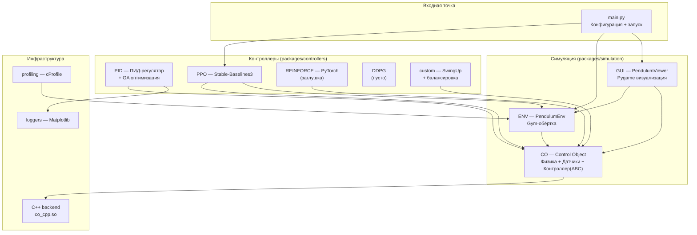

### 1.4 Основные модули и их назначение

| Модуль | Путь | Назначение |
|---|---|---|
| **CO** | `packages/simulation/CO/` | Ядро симуляции: физическая модель (RK4), датчики (квантование+шум), абстрактный контроллер, тактовый движок |
| **ENV** | `packages/simulation/ENV/` | Gymnasium-совместимая обёртка `PendulumEnv` для обучения RL |
| **GUI** | `packages/simulation/GUI/` | Pygame-визуализация: отрисовка, графики, запись видео, интерактивное управление |
| **PID** | `packages/controllers/PID/` | ПИД-регулятор с оптимизацией (Циглер-Николс, генетический алгоритм) |
| **PPO** | `packages/controllers/PPO/` | PPO-агент на базе Stable-Baselines3 |
| **REINFORCE** | `packages/controllers/REINFORCE/` | REINFORCE на PyTorch (в разработке/заглушка) |
| **DDPG** | `packages/controllers/DDPG/` | DDPG (не реализован, пустой файл) |
| **custom** | `packages/controllers/custom/` | SwingUp + балансировка (композитный контроллер) |
| **loggers** | `packages/loggers/` | Matplotlib-логгер для визуализации траекторий |
| **profiling** | `profiling/` | Профилирование производительности (cProfile) |

---

## 2. Структура кода

### 2.1 Дерево файлов и папок

```
RL/
├── main.py                          # Точка входа: конфигурация + запуск PPO + GUI
├── pyproject.toml                   # Корневой Poetry-манифест
├── poetry.lock                      # Зафиксированные версии зависимостей
├── output.gif / output.mp4          # Примеры записанных видео
│
├── packages/
│   ├── simulation/
│   │   ├── CO/                       # Control Object — ядро симуляции
│   │   │   ├── __init__.py           # Публичный API пакета
│   │   │   ├── datatypes.py          # Dataclass-конфигурации (Plant, Sensor, Controller, Noise)
│   │   │   ├── pendulum.py           # ObjectOfControl (физика) + BacklashModel (люфт)
│   │   │   ├── sensor.py             # SensorBlock (квантование + пул шума)
│   │   │   ├── controller.py         # Controller(ABC) + Differentiator + SignalFilter
│   │   │   ├── engine.py             # MotorInertia (апериодическое звено)
│   │   │   ├── run.py                # clock_cycle() — такт управления с задержкой
│   │   │   ├── pyproject.toml        # Подмодуль Poetry
│   │   │   ├── README.md            # Документация пакета CO
│   │   │   └── cpp/                  # C++ backend
│   │   │       ├── co_physics.hpp    # Структуры + объявления функций
│   │   │       ├── co_physics.cpp    # RK4 + уравнения Лагранжа (Cramer)
│   │   │       ├── co_bindings.cpp   # pybind11-обёртки
│   │   │       ├── CMakeLists.txt    # Сборка расширения
│   │   │       └── README.md        # Инструкция по сборке C++
│   │   │
│   │   ├── ENV/                      # Gymnasium-обёртка
│   │   │   ├── __init__.py
│   │   │   ├── env.py                # PendulumEnv(gym.Env)
│   │   │   ├── pyproject.toml
│   │   │   └── README.md
│   │   │
│   │   └── GUI/                      # Pygame-визуализация
│   │       ├── __init__.py           # Экспорт PendulumViewer
│   │       ├── gui.py                # PendulumViewer — главный цикл
│   │       ├── constants.py          # Цвета, размеры, FPS
│   │       ├── draw.py               # Функции отрисовки (тележка, маятник, графики)
│   │       ├── renderer.py           # Renderer — альтернативный класс отрисовки
│   │       ├── event_controller.py  # EventController — адаптер ввода
│   │       ├── input_handling.py    # handle_events() — обработка pygame-событий
│   │       ├── physics_runner.py    # PhysicsRunner — обёртка шагов физики
│   │       ├── dialogs.py           # Диалоги (запись видео, ввод цели)
│   │       ├── recorder.py          # compile_video() — вызов ffmpeg
│   │       ├── recorder_obj.py      # Recorder — объектная обёртка записи
│   │       ├── pyproject.toml
│   │       └── README.md
│   │
│   ├── controllers/
│   │   ├── PID/
│   │   │   ├── __init__.py
│   │   │   ├── pid.py               # PIDController(Controller)
│   │   │   ├── cost_functions.py    # J() — квадратичная стоимость
│   │   │   ├── optimizers.py        # Zigler_Nikols + Genetic_PID_AngleOnly
│   │   │   ├── pyproject.toml
│   │   │   └── README.md
│   │   │
│   │   ├── PPO/
│   │   │   ├── __init__.py          # Экспорт PPOConfig, PPOController
│   │   │   ├── ppo.py               # PPOController(Controller) — обёртка SB3
│   │   │   ├── mode_config.py       # PPOConfig — гиперпараметры
│   │   │   ├── pyproject.toml
│   │   │   └── README.md
│   │   │
│   │   ├── REINFORCE/
│   │   │   ├── __init__.py
│   │   │   ├── reinforce.py         # Reinforce(Controller) — заглушки (...)
│   │   │   ├── mode_config.py       # ReinforceNetworkConfig
│   │   │   ├── pyproject.toml
│   │   │   └── README.md
│   │   │
│   │   ├── DDPG/
│   │   │   ├── __init__.py
│   │   │   ├── ddpg.py              # Пустой файл (не реализован)
│   │   │   ├── pyproject.toml
│   │   │   └── README.md
│   │   │
│   │   └── custom/
│   │       ├── __init__.py
│   │       ├── custom.py            # Пустой файл
│   │       ├── swing_up_block.py   # SwingUp + SwingUpAndBalance
│   │       ├── pyproject.toml
│   │       └── README.md
│   │
│   └── loggers/
│       ├── __init__.py
│       ├── loggers.py               # Logger — Matplotlib dynamic plot
│       ├── pyproject.toml
│       └── README.md
│
└── profiling/
    ├── __init__.py
    ├── profiling.py                 # Профилирование PendulumEnv
    ├── profile_reinforce_train.py   # Профилирование обучения REINFORCE
    ├── pyproject.toml
    └── README.md
```

### 2.2 Взаимосвязи между модулями

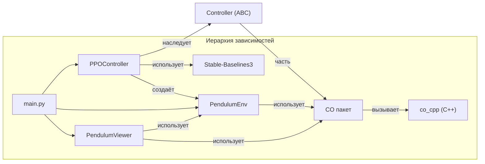

**Ключевые зависимости:**

| Модуль | Зависит от | Тип связи |
|---|---|---|
| `main.py` | `PPOController`, `PendulumEnv`, `PendulumViewer`, `CO` | Импорт + композиция |
| `PPOController` | `Controller` (наследование), `PendulumEnv`, `stable_baselines3` | Наследование + композиция |
| `PIDController` | `Controller` (наследование), `clock_cycle`, `cost_functions` | Наследование + вызов |
| `PendulumEnv` | `ObjectOfControl`, `SensorBlock`, `Controller`, `gymnasium` | Композиция + наследование |
| `PendulumViewer` | `PendulumEnv`, `CO` (clock_cycle), `pygame` | Композиция |
| `ObjectOfControl` | `co_cpp` (C++ backend), `PlantConfig` | Опциональный C++ |
| `clock_cycle` | `Controller`, `ObjectOfControl`, `SensorBlock` | Функция высшего порядка |

### 2.3 Входные точки приложения

#### Основная точка входа: [`main.py`](main.py:1)

```python
# main.py — упрощённая структура
if __name__ == "__main__":
    # 1. Конфигурация (PlantConfig, SensorConfig, ControllerConfig, NoiseForce)
    # 2. Создание PPOController
    # 3. Обучение: ppo_controller.train(...)
    # 4. Создание PendulumEnv с обученным контроллером
    # 5. Запуск GUI: viewer.use()
```

**Жизненный цикл запуска:**

1. Создаются конфигурации физической модели, датчиков, регулятора и шума
2. Создаётся `PPOController` с гиперпараметрами `PPOConfig`
3. Вызывается `train()` — запускается обучение PPO через Stable-Baselines3 (создаётся `PendulumEnv`, `DummyVecEnv`, callback'и для чекпоинтов и оценки)
4. После обучения создаётся `PendulumEnv` с обученным контроллером
5. Создаётся `PendulumViewer` и вызывается `use()` — блокирующий главный цикл Pygame

#### Дополнительные точки входа:

| Файл | Назначение |
|---|---|
| [`profiling/profiling.py`](profiling/profiling.py:1) | Профилирование `PendulumEnv` (cProfile, 5 эпизодов × 500 шагов) |
| [`profiling/profile_reinforce_train.py`](profiling/profile_reinforce_train.py:1) | Профилирование обучения REINFORCE (3 эпизода) |

### 2.4 Конфигурационные файлы

#### Корневой [`pyproject.toml`](pyproject.toml:1)

Poetry-манифест, описывающий:
- Зависимости: numpy, matplotlib, pygame, scipy, numba, torch (CPU), gymnasium, stable-baselines3, tensorboard, tqdm, statsmodels, scikit-optimize
- Локальные подмодули (path-зависимости): `co`, `pid`, `gui`, `profiling`, `loggers`, `reinforce`, `custom`, `ppo`
- Источники пакетов: PyTorch CPU (приоритет `explicit`)
- Dev-зависимости: `mlflow`, `ipykernel`

#### Подмодульные `pyproject.toml`

Каждый пакет имеет собственный `pyproject.toml` для независимой установки:

| Пакет | Описание |
|---|---|
| `packages/simulation/CO/pyproject.toml` | `co` — Control Object, Python ^3.12 |
| `packages/controllers/PID/pyproject.toml` | `pid` — ПИД-регулятор |
| `packages/controllers/PPO/pyproject.toml` | `ppo` — PPO-контроллер |
| `packages/controllers/REINFORCE/pyproject.toml` | `reinforce` — REINFORCE |
| `packages/controllers/custom/pyproject.toml` | `custom` — кастомные контроллеры |
| `packages/simulation/GUI/pyproject.toml` | `gui` — визуализация |
| `packages/simulation/ENV/pyproject.toml` | `env` — Gym-среда |
| `packages/loggers/pyproject.toml` | `loggers` — логирование |
| `profiling/pyproject.toml` | `profiling` — профилирование |

#### C++ сборка: [`packages/simulation/CO/cpp/CMakeLists.txt`](packages/simulation/CO/cpp/CMakeLists.txt:1)

CMake-конфигурация для сборки pybind11-расширения `co_cpp`:
- Требует CMake ≥ 3.20, C++17
- Находит Python и pybind11 через `Python_EXECUTABLE`
- Собирает `co_bindings.cpp` + `co_physics.cpp` → `co_cpp.so` (Linux) / `co_cpp.pyd` (Windows)
- Выходной файл помещается в `packages/simulation/CO/` для импорта

---

## 3. Ключевые компоненты

### 3.1 Пакет CO (Control Object)

Пакет `CO` — ядро симуляции. Реализует физическую модель, датчики, абстрактный контроллер и тактовый движок.

#### 3.1.1 `PlantConfig` — конфигурация физической модели

**Файл:** [`packages/simulation/CO/datatypes.py`](packages/simulation/CO/datatypes.py:51)

**Назначение:** Dataclass, хранящий все физические параметры тележки с маятником.

| Поле | Тип | По умолч. | Описание |
|---|---|---|---|
| `M` | `float` | `1.0` | Масса тележки (кг) |
| `m1` | `float` | `0.3` | Масса первого звена (кг) |
| `m2` | `float` | `0.0` | Масса второго звена (кг) |
| `l1` | `float` | `1.0` | Длина первого звена (м) |
| `l2` | `float` | `0.0` | Длина второго звена (м) |
| `g` | `float` | `9.81` | Ускорение свободного падения (м/с²) |
| `b_c` | `float` | `0.0` | Вязкое трение тележки |
| `b_1` | `float` | `0.0` | Вязкое трение шарнира θ₁ |
| `b_2` | `float` | `0.0` | Вязкое трение шарнира θ₂ |
| `single_pendulum_mode` | `bool` | `True` | Однозвенный режим |
| `backslash_mode` | `bool` | `False` | Учёт люфта редуктора |
| `backlash_alpha` | `float` | `0.0` | Ширина зазора (м) |
| `backlash_m_mot` | `float` | `0.0` | Приведённая масса ротора (кг) |
| `motor_time_constant` | `float` | `0.0` | Постоянная времени двигателя (с) |
| `init_q` | `np.ndarray` | `[0, π, 0]` | Начальные координаты |
| `init_dq` | `np.ndarray` | `[0, 0, 0]` | Начальные скорости |
| `dt` | `float` | `0.0005` | Шаг интегрирования (с) |
| `L1` | `float` | (вычисл.) | Расстояние до ЦМ 1-го звена = `l1/2` |
| `L2` | `float` | (вычисл.) | Расстояние до ЦМ 2-го звена = `l2/2` |
| `J1` | `float` | (вычисл.) | Момент инерции 1-го звена = `m1·l1²/12` |
| `J2` | `float` | (вычисл.) | Момент инерции 2-го звена = `m2·l2²/12` |

**Методы:**
- `__post_init__()` — вычисляет `L1, L2, J1, J2` (однородный стержень)
- `to_dict() → dict` — сериализация для `ObjectOfControl`
- `copy() → PlantConfig` — глубокая копия с независимыми массивами

**Жизненный цикл:** Создаётся в `main.py` или в скриптах профилирования. Передаётся по ссылке в `ObjectOfControl`, `PendulumEnv`, контроллеры. Не изменяется после создания (immutable intent, но технически mutable).

#### 3.1.2 `SensorConfig` — конфигурация датчиков

**Файл:** [`packages/simulation/CO/datatypes.py`](packages/simulation/CO/datatypes.py:216)

| Поле | Тип | По умолч. | Описание |
|---|---|---|---|
| `encoder_resolution_1` | `int` | `4096` | Разрядность энкодера θ₁ (имп./оборот) |
| `encoder_resolution_2` | `int` | `4096` | Разрядность энкодера θ₂ |
| `cart_sensor_resolution` | `float` | `0.0001` | Дискретность датчика тележки (м) |
| `noise_std_q` | `tuple` | `(0.001, 0.005, 0.005)` | СКО шума координат |
| `noise_std_dq` | `tuple` | `(0.01, 0.02, 0.02)` | СКО шума скоростей |
| `seed` | `int \| None` | `None` | Seed для воспроизводимости |

#### 3.1.3 `ControllerConfig` — конфигурация регулятора

**Файл:** [`packages/simulation/CO/datatypes.py`](packages/simulation/CO/datatypes.py:285)

| Поле | Тип | По умолч. | Описание |
|---|---|---|---|
| `dt` | `float` | `0.005` | Такт управления (с) — 200 Гц |
| `max_force` | `float` | `30.0` | Максимальная сила (Н) |
| `has_velocity_sensors` | `bool` | `False` | Наличие аппаратных датчиков скоростей |
| `differentiator_cutoff_hz` | `float \| None` | `None` | Частота среза дифференциатора |
| `filter_cutoff_hz` | `float` | `50.0` | Частота среза ФНЧ сигнала (Гц) |

#### 3.1.4 `NoiseForce` — внешнее возмущение

**Файл:** [`packages/simulation/CO/datatypes.py`](packages/simulation/CO/datatypes.py:9)

**Назначение:** Параметры белого шума, добавляемого к управляющей силе.

```python
@dataclass
class NoiseForce:
    mean: float = 0.0
    std: float = 0.0

    def get_force(self) -> float:
        if self.std == 0.0:
            return self.mean
        return random.gauss(self.mean, self.std)
```

**Жизненный цикл:** Создаётся в `main.py`, передаётся в `ObjectOfControl.update_physics()` и `clock_cycle()`. Не хранит состояние — каждый вызов `get_force()` генерирует новое значение.

#### 3.1.5 `ObjectOfControl` — физическая модель

**Файл:** [`packages/simulation/CO/pendulum.py`](packages/simulation/CO/pendulum.py:131)

**Назначение:** Математическая модель тележки с одно-/двухзвенным маятником. Интегрирует уравнения движения методом RK4.

**Иерархия:** Отдельный класс (не наследник).

**Зависимости:**
- `PlantConfig` (конфигурация)
- `co_cpp` (C++ backend, опционально, но **обязательно** для работы)
- `BacklashModel` (если `backslash_mode=True`)
- `NoiseForce` (через `update_physics`)

**Свойства:**

| Свойство | Тип | Описание |
|---|---|---|
| `q` | `np.ndarray` | Координаты `[x, θ₁, θ₂]` — **возвращает копию** |
| `dq` | `np.ndarray` | Скорости `[ẋ, θ̇₁, θ̇₂]` — **возвращает копию** |
| `backlash_model` | `BacklashModel \| None` | Модель люфта |
| `motor_tau` | `float` | Постоянная времени двигателя |
| `motor_force` | `float` | Текущее реальное усилие (Н) |
| `single_pendulum_mode` | `bool` | Флаг однозвенного режима |

**Основные методы:**

| Метод | Сигнатура | Описание |
|---|---|---|
| `update_physics` | `(F_ideal: float, F_noise: NoiseForce) → None` | Главный шаг: инерция → люфт → шум → RK4 |
| `reset` | `() → None` | Сброс к начальному состоянию |
| `get_clean_state` | `() → tuple[q, dq]` | Чистые (неискажённые) координаты |

**Жизненный цикл:**
1. **Создание:** `ObjectOfControl(plant_config)` — извлекает параметры, создаёт C++ объекты (`PlantParams`, `State3`, `StateDot3`), инициализирует состояние
2. **Использование:** Многократный вызов `update_physics(F_ideal, noise)` в цикле симуляции
3. **Сброс:** `reset()` — восстановление начальных `q`, `dq`, обнуление `motor_force`
4. **Уничтожение:** GC Python (C++ объекты освобождаются через pybind11)

> ⚠️ **Важно:** `update_physics()` **требует** собранный C++ модуль `co_cpp`. Python-fallback для RK4 **не реализован** — вызов `raise RuntimeError` если `co_cpp` недоступен.

**Пример использования:**

```python
from packages.simulation.CO import ObjectOfControl, PlantConfig, NoiseForce

config = PlantConfig(M=1.0, m1=0.1, l1=0.3, dt=0.0001, motor_time_constant=0.05)
plant = ObjectOfControl(config)
noise = NoiseForce(mean=0.0, std=0.03)

for _ in range(1000):
    plant.update_physics(F_ideal=5.0, F_noise=noise)

print(f"Позиция: {plant.q[0]:.3f} м, Угол: {np.degrees(plant.q[1]):.1f}°")
```

#### 3.1.6 `BacklashModel` — модель люфта редуктора

**Файл:** [`packages/simulation/CO/pendulum.py`](packages/simulation/CO/pendulum.py:15)

**Назначение:** Моделирует зазор механического редуктора. Пока мотор внутри зазора — усилие не передаётся.

> ⚠️ **TODO:** Модель может быть удалена. По умолчанию `backslash_mode=False`.

**Алгоритм:**
1. Вычислить ускорение ротора: `a_rel = F_ideal / m_mot`
2. Обновить положение в зазоре: `gap_pos += a_rel * dt`
3. Если `gap_pos` выходит за `[-α/2, +α/2]` — фиксация на границе, `F_real = F_ideal`; иначе `F_real = 0`

#### 3.1.7 `SensorBlock` — блок датчиков

**Файл:** [`packages/simulation/CO/sensor.py`](packages/simulation/CO/sensor.py:6)

**Назначение:** Моделирует квантование энкодеров и аддитивный белый шум.

**Ключевая оптимизация:** Пул шума размером 2 000 000 значений предвычисляется в `__init__`. В горячем цикле шум берётся из пула по циклическому индексу — **без вызова RNG**.

**Методы:**

| Метод | Сигнатура | Описание |
|---|---|---|
| `get_telemetry` | `(raw_q, raw_dq) → np.ndarray` | Квантование + шум → `(x, θ₁, θ₂, ẋ, θ̇₁, θ̇₂)` |

**Внутреннее устройство:**
- `_noise_pool`: `np.ndarray` формы `(2_000_000, 6)` — предвычисленный шум
- `_noise_index`: циклический индекс (сбрасывается в 0 при достижении `pool_size`)
- `_meas`: переиспользуемый буфер результата (1 аллокация на такт)

> ⚠️ **Ограничение:** При `max_steps > 2_000_000` шум начнёт повторяться. `pool_size` захардкожен — не вынесен в `SensorConfig`.

#### 3.1.8 `Controller` (ABC) — абстрактный контроллер

**Файл:** [`packages/simulation/CO/controller.py`](packages/simulation/CO/controller.py:192)

**Назначение:** Абстрактный базовый класс для всех регуляторов. Реализует паттерн **Template Method**.

**Иерархия наследования:**

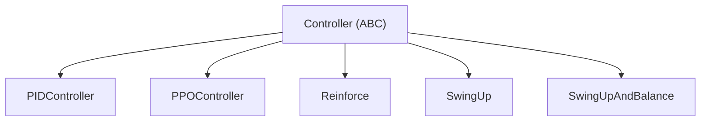

**Конвейер обработки сигнала (Template Method `action()`):**

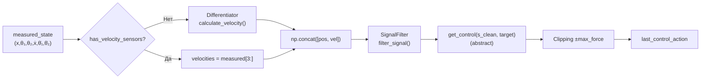

**Абстрактный метод:**

```python
@abstractmethod
def get_control(self, s_clean: np.ndarray, target_state: np.ndarray) -> float:
    """Закон управления. Возвращает идеальную силу (Н) до насыщения."""
    ...
```

**Методы:**

| Метод | Сигнатура | Описание |
|---|---|---|
| `action` | `(measured_state, target_state) → float` | Template Method: полный конвейер |
| `get_control` | `(s_clean, target_state) → float` | **Абстрактный** — закон управления |
| `set_motor_inertia` | `(time_constant) → None` | ⚠️ Deprecated (перенесено в PlantConfig) |
| `reset` | `() → None` | Сброс Differentiator, SignalFilter, last_control_action |

> ⚠️ **Несоответствие API:** Базовый метод называется `action()`, а абстрактный — `get_control()`. Однако `SwingUp` и `SwingUpAndBalance` переопределяют метод `get_action()` (а не `get_control()`), что приведёт к `TypeError` при инстанциации. Это известная несогласованность в коде.

#### 3.1.9 `Differentiator` — численное дифференцирование

**Файл:** [`packages/simulation/CO/controller.py`](packages/simulation/CO/controller.py:17)

**Алгоритм:** Backward difference + EMA-сглаживание.

$$v_k = \frac{q_k - q_{k-1}}{dt}, \quad v^{filt}_k = \alpha \cdot v_k + (1-\alpha) \cdot v^{filt}_{k-1}$$

$$\alpha = \frac{dt}{\tau + dt}, \quad \tau = \frac{1}{2\pi f_{cut}}$$

#### 3.1.10 `SignalFilter` — ФНЧ первого порядка

**Файл:** [`packages/simulation/CO/controller.py`](packages/simulation/CO/controller.py:116)

**Алгоритм:** Экспоненциальное сглаживание (EMA).

$$y_k = \alpha \cdot u_k + (1-\alpha) \cdot y_{k-1}$$

#### 3.1.11 `MotorInertia` — инерционность двигателя

**Файл:** [`packages/simulation/CO/engine.py`](packages/simulation/CO/engine.py:1)

**Назначение:** Апериодическое звено первого порядка. Моделирует инерционность привода.

**Передаточная функция:** $W(s) = \frac{1}{\tau s + 1}$

**Дискретная аппроксимация:** $F_{k+1} = F_k + (F_{target} - F_k) \cdot \frac{dt}{\tau}$

> ⚠️ **Дублирование логики:** Инерционность двигателя реализована **в трёх местах**: в `MotorInertia` (Python), в `ObjectOfControl` (через C++ backend), и в `co_bindings.cpp` (C++). При этом `MotorInertia` фактически не используется в основном потоке — инерция обрабатывается в C++.

#### 3.1.12 `clock_cycle()` — такт управления

**Файл:** [`packages/simulation/CO/run.py`](packages/simulation/CO/run.py:9)

**Назначение:** Свободная функция, выполняющая один такт управления с имитацией вычислительной задержки.

**Алгоритм:**
1. Вычислить число микрошагов физики в одном control-tick: `steps = dt_control / dt_physics`
2. Случайная доля `freeze_ratio ∈ [0.2, 0.5]` — фаза "заморозки" (физика с предыдущей силой)
3. Получить телеметрию и пересчитать управление
4. Оставшаяся часть такта: физика с новой силой
5. Вернуть `J(target, measured)` и `F_raw`

**Сигнатура:**

```python
def clock_cycle(
    controller: Controller,
    plant: ObjectOfControl,
    sensor: SensorBlock,
    noise: NoiseForce,
    old_F: float,
    target_state: np.ndarray,
    J: Callable[[np.ndarray, np.ndarray], float],
) -> tuple[float, float]:
```

> ⚠️ **Важно:** `clock_cycle` вызывает `controller.compute_control()`, но в текущей версии `Controller` метод называется `action()`. Это **несоответствие** — `clock_cycle` несовместим с текущим API `Controller`.

#### 3.1.13 C++ Backend

**Файлы:**
- [`packages/simulation/CO/cpp/co_physics.hpp`](packages/simulation/CO/cpp/co_physics.hpp:1) — заголовок
- [`packages/simulation/CO/cpp/co_physics.cpp`](packages/simulation/CO/cpp/co_physics.cpp:1) — реализация
- [`packages/simulation/CO/cpp/co_bindings.cpp`](packages/simulation/CO/cpp/co_bindings.cpp:1) — pybind11

**Структуры данных (C++):**

| Структура | Поля | Описание |
|---|---|---|
| `State3` | `x, theta1, theta2` | Обобщённые координаты |
| `StateDot3` | `x_dot, theta1_dot, theta2_dot` | Обобщённые скорости |
| `PlantParams` | `M, m1, m2, l1, l2, L1, L2, J1, J2, g, b_c, b_1, b_2, motor_tau` | Физические параметры |
| `NoiseForceCPP` | `mean, std` | Параметры шума |

**Функции (C++):**

| Функция | Описание |
|---|---|
| `compute_ddq(q, dq, F, params, single_mode)` | Вычисление ускорений через уравнения Лагранжа (метод Крамера 3×3 или 2×2) |
| `rk4_step(q, dq, F, dt, params, single_mode)` | Один микрошаг RK4 (k1→k2→k3→k4) |
| `sample_noise_force(n)` | Генерация шума (thread-local `std::mt19937`) |

**Pybind11-функции (Python-доступные):**

| Функция | Описание |
|---|---|
| `co_cpp.update_physics_cpp(q, dq, F, ...)` | Основной шаг: инерция → люфт → шум → RK4, in-place |
| `co_cpp.rk4_step(q, dq, ...)` | RK4 с возвратом нового состояния |
| `co_cpp.NoiseForce(mean, std)` | Класс шума |
| `co_cpp.State3 / StateDot3 / PlantParams` | Доступ к полям структур |

**Уравнения движения (из `co_physics.cpp`):**

Уравнения выводятся из формализма Лагранжа 2-го рода:

$$M(q) \cdot \ddot{q} + C(q, \dot{q}) \cdot \dot{q} + G(q) = \tau$$

где:
- `M(q)` — матрица инерции (3×3 для двухзвенного, 2×2 для однозвенного)
- `C(q, dq)` — матрица кориолисовых/центробежных сил
- `G(q)` — гравитационные силы
- `τ` — обобщённые силы (управление + трение + шум)

Решение: метод Крамера для 3×3 (или 2×2) системы. При `|det| < 1e-18` возвращаются нули (защита от сингулярности).

**Нормализация углов:** После каждого шага RK4 углы нормализуются в `[0, 2π)` через `std::fmod`.

### 3.2 Пакет ENV (Gym-обёртка)

#### 3.2.1 `PendulumEnv`

**Файл:** [`packages/simulation/ENV/env.py`](packages/simulation/ENV/env.py:14)

**Назначение:** Gymnasium-совместимая обёртка для симуляции маятника. Инкапсулирует `ObjectOfControl` и `SensorBlock`.

**Иерархия:** `PendulumEnv(gym.Env)`

**Зависимости:**
- `ObjectOfControl` (физика)
- `SensorBlock` (датчики)
- `Controller` (регулятор)
- `gymnasium` (базовый класс)

**Пространства:**

| Пространство | Размерность | Диапазон | Описание |
|---|---|---|---|
| `observation_space` | `(12,)` | `[-inf, inf]` | `[state(6), target(6)]` |
| `action_space` | `(1,)` | `[-max_force, +max_force]` | Сила (Н) |

**Методы Gym:**

| Метод | Сигнатура | Описание |
|---|---|---|
| `reset` | `(*, seed, options) → (obs, info)` | Сброс среды |
| `step` | `(action) → (obs, reward, terminated, truncated, info)` | Один шаг симуляции |
| `render` | `(mode) → None` | Заглушка (рендеринг в GUI) |

**Логика `step()`:**

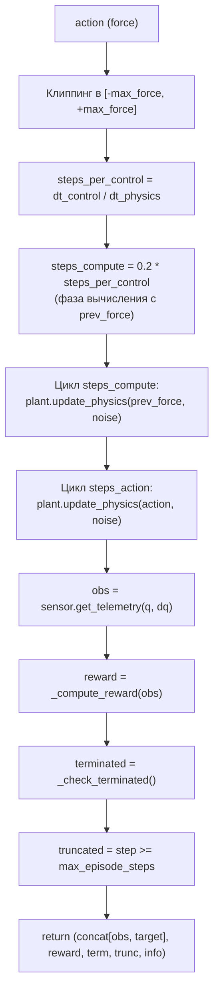

**Функция награды (по умолчанию):**

$$r = -(w_x \cdot e_x^2 + w_\theta \cdot e_\theta^2 + w_{dx} \cdot e_{dx}^2 + w_{d\theta} \cdot e_{d\theta}^2) + \text{bonus}$$

где веса: `w_x=1.0, w_theta=10.0, w_dx=0.5, w_dtheta=0.5`. Бонус `+1.0` если `|e_x| < 0.05` и `|e_θ| < 0.05`.

**Условия завершения (`terminated`):**
- Отклонение маятника от цели > 40°
- Отклонение тележки от цели по x > 2 м

**Свойства:**

| Свойство | Тип | Описание |
|---|---|---|
| `plant` | `ObjectOfControl` | Физическая модель |
| `sensor` | `SensorBlock` | Датчики |
| `controller` | `Controller` | Регулятор |
| `target_state` | `np.ndarray` | Целевой вектор (с setter) |

### 3.3 Пакет GUI (Визуализация)

#### 3.3.1 `PendulumViewer`

**Файл:** [`packages/simulation/GUI/gui.py`](packages/simulation/GUI/gui.py:44)

**Назначение:** Pygame-визуализация симуляции с интерактивным управлением.

**Зависимости:**
- `PendulumEnv` (среда)
- `pygame` (рендеринг)
- `ffmpeg` (сборка видео, через `recorder.py`)

**Главный цикл (`use()`):**

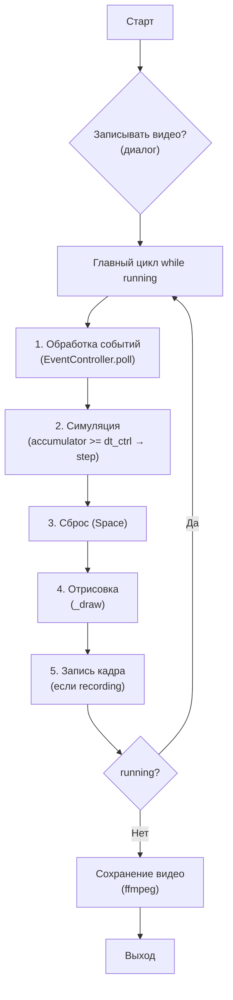

**Управление:**

| Клавиша | Действие |
|---|---|
| `Space` | Сброс симуляции |
| `C` | Включить/выключить контроллер |
| `Q` / `ESC` | Выход |
| `←` / `→` | Перемещение цели |
| Мышь (drag) | Перетаскивание маркера цели |

**Отрисовка:**
- Тележка с колёсами
- Маятник(ы) — одно- или двухзвенный
- Стрелка силы (зелёная — вправо, красная — влево)
- HUD: сила, координаты, скорости, коэффициенты
- Осциллограф: `sin(θ)` скроллирующийся график
- График ошибки по X
- Маркер цели (зелёная точка)
- Кнопка CTRL ON/OFF

**Запись видео:**
1. Диалог "Record simulation to video?" (Y/N)
2. При записи: сохранение PNG-кадров в temp-директорию
3. При выходе: вызов `ffmpeg` для сборки MP4
4. FPS видео вычисляется из реального времени и числа кадров

**Внутренние буферы:**
- `_sin1_history`, `_sin2_history`, `_err_history` — `deque(maxlen=800)` для графиков
- `_csv_time`, `_csv_sin1`, `_csv_sin2`, `_csv_err_x` — полная история для CSV (неограниченная)

#### 3.3.2 Вспомогательные модули GUI

| Модуль | Класс/Функция | Назначение |
|---|---|---|
| `constants.py` | Константы | Цвета, размеры, FPS=250, SCALE=350 |
| `draw.py` | `draw_cart`, `draw_pendulums`, `draw_force_arrow`, `draw_hud`, `draw_sine_graph`, `draw_error_graph`, `draw_target_marker` | Функции отрисовки |
| `renderer.py` | `Renderer` | Альтернативный класс отрисовки (не используется в основном потоке) |
| `event_controller.py` | `EventController` | Адаптер для `handle_events()` |
| `input_handling.py` | `handle_events()` | Обработка pygame-событий → словарь действий |
| `physics_runner.py` | `PhysicsRunner` | Обёртка шагов физики (не используется в основном потоке) |
| `dialogs.py` | `ask_recording`, `ask_save_video`, `ask_input_target` | Диалоговые окна |
| `recorder.py` | `compile_video()` | Вызов ffmpeg для сборки MP4 |
| `recorder_obj.py` | `Recorder` | Объектная обёртка записи (не используется в основном потоке) |

> ⚠️ **Дублирование:** `Renderer`, `PhysicsRunner`, `Recorder` — объектные обёртки, которые **не используются** в основном потоке `PendulumViewer`. Функциональность дублируется методами `PendulumViewer`.

### 3.4 Контроллеры

#### 3.4.1 `PIDController`

**Файл:** [`packages/controllers/PID/pid.py`](packages/controllers/PID/pid.py:52)

**Назначение:** ПИД-регулятор с демпфированием по положению и скорости тележки.

**Иерархия:** `PIDController(Controller)`

**Закон управления:**

$$u = K_p \cdot e_\theta + K_i \cdot \int e_\theta \, dt + K_d \cdot \dot{e}_\theta + K_x \cdot e_x + K_{dx} \cdot \dot{e}_x$$

где $e = \text{target} - s_{\text{clean}}$.

**Коэффициенты:** `[Kp, Ki, Kd, Kx, Kdx]` (по умолчанию `[10, 1, 2, 1, 2]`)

**Методы:**

| Метод | Сигнатура | Описание |
|---|---|---|
| `get_control` | `(s_clean, target_state) → float` | ПИД-закон |
| `reset` | `() → None` | Сброс интеграла + базовый reset |
| `reset_angel_integral` | `() → None` | Сброс интегральной составляющей |
| `train` | `(plant_config, sensor_config, noise, optimizer, target_state, ...) → None` | Оптимизация коэффициентов |

**Оптимизация коэффициентов:**

| Оптимизатор | Файл | Метод | Назначение |
|---|---|---|---|
| `Zigler_Nikols` | `optimizers.py:17` | Циглер-Николс | ⚠️ Deprecated — только графики отклика |
| `Genetic_PID_AngleOnly` | `optimizers.py:254` | Генетический алгоритм | Оптимизация Kp, Ki, Kd |

**Генетический алгоритм (`Genetic_PID_AngleOnly`):**

| Параметр | По умолч. | Описание |
|---|---|---|
| `population_size` | 200 | Размер популяции |
| `generations` | 30 | Число поколений |
| `elite_frac` | 0.2 | Доля элиты |
| `tournament_k` | 3 | Размер турнира |
| `mutation_sigma` | 1.5 | СКО мутации (затухает) |
| `mutation_prob` | 0.4 | Вероятность мутации |
| `crossover_prob` | 0.7 | Вероятность кроссовера |

**Фитнес-функция:** Минимизация отклонения угла. Раннее завершение если угол удерживается в пределах `early_stop_angle` (0.01 рад) в течение `early_stop_steps` (50) шагов.

#### 3.4.2 `PPOController`

**Файл:** [`packages/controllers/PPO/ppo.py`](packages/controllers/PPO/ppo.py:29)

**Назначение:** PPO-агент, обёрнутый в интерфейс `Controller`. Использует Stable-Baselines3.

**Иерархия:** `PPOController(Controller)`

**Зависимости:**
- `stable_baselines3.PPO` (алгоритм)
- `PendulumEnv` (среда обучения)
- `PPOConfig` (гиперпараметры)

**Методы:**

| Метод | Сигнатура | Описание |
|---|---|---|
| `get_control` | `(s_clean, target_state) → float` | Детерминированное действие политики |
| `train` | `(plant_config, sensor_config, noise, target_state, ...) → None` | Обучение PPO через SB3 |
| `save` | `(path) → None` | Сохранение модели |
| `load` | `(path) → None` | Загрузка модели |
| `from_pretrained` | `(path, ...) → PPOController` | Создание с предобученной моделью |
| `reset` | `() → None` | Сброс состояния |

**Обучение (`train()`):**
1. Создаётся фабрика среды `make_env()` → `PendulumEnv`
2. Оборачивается в `DummyVecEnv`
3. Создаются callback'и: `CheckpointCallback` (чекпоинты), `EvalCallback` (оценка + ранняя остановка)
4. Создаётся `SB3_PPO` с гиперпараметрами из `PPOConfig`
5. Вызывается `model.learn(total_timesteps, callback=[...])`

**PPOConfig (гиперпараметры):**

| Параметр | По умолч. | Описание |
|---|---|---|
| `policy` | `"MlpPolicy"` | Архитектура политики |
| `net_arch` | `[128, 128]` | Слои сети |
| `learning_rate` | `3e-4` | Скорость обучения |
| `n_steps` | `2048` | Шагов на обновление |
| `batch_size` | `64` | Размер батча |
| `n_epochs` | `10` | Эпох PPO |
| `gamma` | `0.99` | Дисконтирование |
| `gae_lambda` | `0.95` | GAE lambda |
| `clip_range` | `0.2` | Обрезка PPO |
| `ent_coef` | `0.0` | Коэффициент энтропии |
| `max_grad_norm` | `0.5` | Обрезка градиента |
| `total_timesteps` | `500_000` | Всего шагов обучения |
| `max_episode_steps` | `10000` | Макс. шагов в эпизоде |

#### 3.4.3 `Reinforce` (заглушка)

**Файл:** [`packages/controllers/REINFORCE/reinforce.py`](packages/controllers/REINFORCE/reinforce.py:45)

**Назначение:** REINFORCE на PyTorch. **В разработке** — все методы содержат только `...` (заглушки).

**Иерархия:** `Reinforce(Controller)` + `ReinforceNet(nn.Module)`

**Конфигурация (`ReinforceNetworkConfig`):**

| Параметр | Описание |
|---|---|
| `state_dim` | Размерность состояния |
| `action_dim` | Размерность действия |
| `hidden_layers` | `[64, 64]` по умолчанию |
| `activation` | `"relu"` |
| `learning_rate` | `1e-2` |
| `output_activation` | `"tanh"` |

#### 3.4.4 `SwingUp` и `SwingUpAndBalance`

**Файл:** [`packages/controllers/custom/swing_up_block.py`](packages/controllers/custom/swing_up_block.py:1)

**Назначение:** Композитный контроллер для раскачки маятника из нижнего положения и последующей балансировки.

**`SwingUp`:** Энергетический метод — управление на основе разности текущей и целевой энергии.

$$E = \frac{1}{2} m_1 L_1 \dot{\theta}^2 - m_1 g L_1 (1 - \cos\theta)$$
$$F = K \cdot \tanh(E - E_t) \cdot \text{sign}(\dot{\theta} \cdot \cos\theta)$$

> ⚠️ **Баг:** В `get_action()` после вычисления `F` стоит `if/else` с `return 40` / `return -40`, что делает вычисление `F` недостижимым (dead code).

**`SwingUpAndBalance`:** Композитный контроллер — переключение между `SwingUp` и `PIDController` в зависимости от положения маятника.

```python
def get_action(self, s_clean, target_state) -> float:
    if check_linerised_position(s_clean):  # |π - θ| < 50°
        return self._balance_controller.get_action(s_clean, target_state)
    return self._swing_up_controller.get_action(s_clean, target_state)
```

> ⚠️ **Несоответствие API:** `SwingUp` и `SwingUpAndBalance` переопределяют `get_action()`, а не `get_control()` — это несовместимо с текущим `Controller(ABC)`.

#### 3.4.5 DDPG

**Файл:** [`packages/controllers/DDPG/ddpg.py`](packages/controllers/DDPG/ddpg.py:1)

**Статус:** Не реализован (пустой файл).

### 3.5 Пакет loggers

**Файл:** [`packages/loggers/loggers.py`](packages/loggers/loggers.py:1)

**Класс:** `Logger`

**Назначение:** Matplotlib-логгер для динамической визуализации траектории угла маятника.

**Методы:**

| Метод | Сигнатура | Описание |
|---|---|---|
| `draw_dynamic_plot` | `(trajectory, dt) → None` | Обновление графика θ(t) |
| `close` | `() → None` | Закрытие окна |

> ⚠️ `packages/loggers/__init__.py` — **пустой**. Импорт `from loggers import Logger` не сработает без явного указания модуля. Контроллеры импортируют `from loggers import Logger`, что может вызвать `ImportError`.

### 3.6 Пакет profiling

**Файлы:**
- [`profiling/profiling.py`](profiling/profiling.py:1) — профилирование `PendulumEnv`
- [`profiling/profile_reinforce_train.py`](profiling/profile_reinforce_train.py:1) — профилирование обучения REINFORCE

**Назначение:** Измерение производительности с помощью `cProfile`.

**Результаты:**
- `profiling_outputs/*.pstats` — дампы cProfile
- Вывод топ-30 функций по `cumtime` и топ-15 по `time`

> ⚠️ `profiling/profiling.py` создаёт `PendulumEnv` с параметром `dt_control=0.005`, которого **нет** в текущей сигнатуре `PendulumEnv.__init__()` (параметр не используется — `dt_control` берётся из `controller.dt`). Это вызовет `TypeError`.

---

## 4. Потоки данных (Data Flow)

### 4.1 Общий поток данных

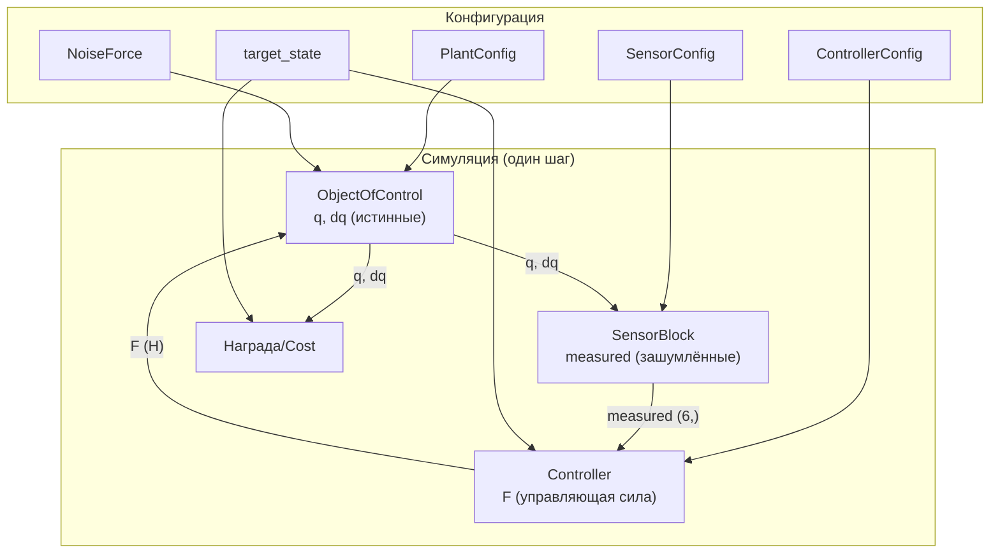

### 4.2 Диаграмма последовательности: один такт управления

#### Через `clock_cycle()` (для PID/GA):

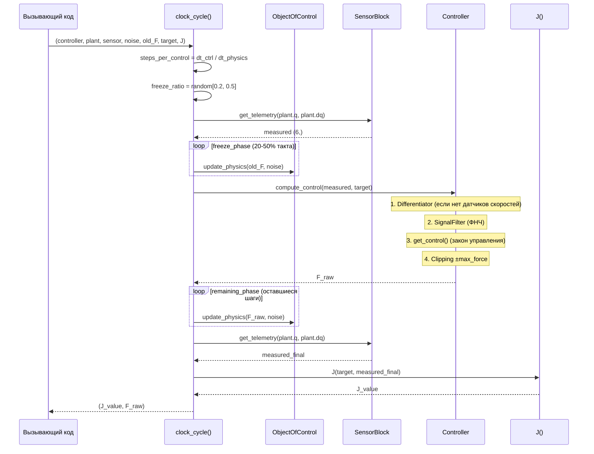

#### Через `PendulumEnv.step()` (для PPO/RL):

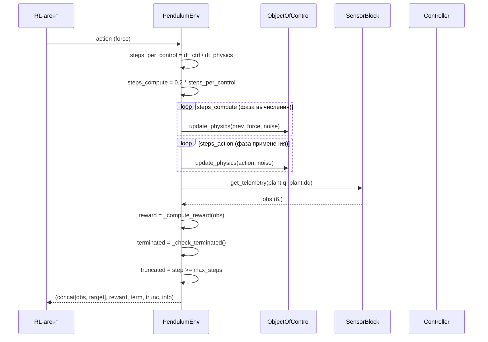

### 4.3 Диаграмма последовательности: обучение PPO

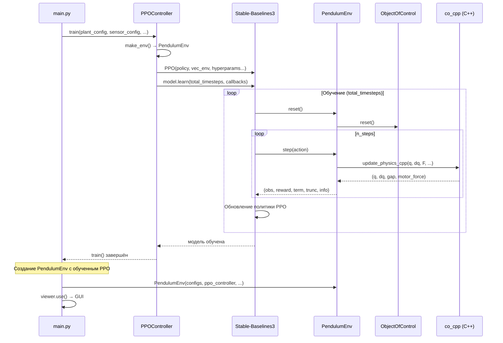

### 4.4 Форматы данных

#### Вектор состояния

| Индекс | Обозначение | Единица | Описание |
|---|---|---|---|
| 0 | `x` | м | Позиция тележки |
| 1 | `θ₁` | рад | Угол первого звена (π = вертикально вверх) |
| 2 | `θ₂` | рад | Угол второго звена |
| 3 | `ẋ` | м/с | Скорость тележки |
| 4 | `θ̇₁` | рад/с | Угловая скорость первого звена |
| 5 | `θ̇₂` | рад/с | Угловая скорость второго звена |

#### Наблюдение (observation) в PendulumEnv

```python
observation = np.concat([measured_state(6), target_state(6)])  # (12,)
```

#### Действие (action) в PendulumEnv

```python
action: np.ndarray | float  # скаляр — сила (Н), клиппируется в [-max_force, +max_force]
```

#### Info-словарь (возвращается из `step()`)

```python
info = {
    "step": int,           # номер шага
    "force": float,        # применённая сила (Н)
    "real_new_s": np.ndarray,  # истинные координаты q (без шума)
}
```

#### Конфигурации (Dataclass'ы)

Все конфигурации — `@dataclass` с методом `to_dict()`:

| Dataclass | Размерность | Метод сериализации |
|---|---|---|
| `PlantConfig` | ~20 полей | `to_dict() → dict` |
| `SensorConfig` | 6 полей | `to_dict() → dict` |
| `ControllerConfig` | 5 полей | `to_dict() → dict` |
| `NoiseForce` | 2 поля | `get_force() → float` |
| `PPOConfig` | 13 полей | — |
| `ReinforceNetworkConfig` | 6 полей | — |

### 4.5 Обработка ошибок и исключительные ситуации

| Ситуация | Исключение | Где | Обработка |
|---|---|---|---|
| C++ backend не собран | `RuntimeError` | `ObjectOfControl.update_physics()` | Жёсткая ошибка — симуляция невозможна |
| PPO-модель не загружена | `RuntimeError` | `PPOController.get_control()` | Жёсткая ошибка — нужно вызвать `train()` или `load()` |
| Среда не инициализирована | `RuntimeError` | `PendulumEnv.step()` | Проверка `plant is None` |
| Несовместимая форма `q`/`dq` | `ValueError` | `ObjectOfControl.q`/`dq` setter | Проверка `shape == (3,)` |
| Сингулярная матрица (C++) | Возврат нулей | `compute_ddq()` | `if |det| < 1e-18: return {0,0,0}` |
| Ошибка ffmpeg | `None` (тихо) | `compile_video()` | `try/except` → возврат `None` |
| Ошибка сохранения кадра | Тихо | `PendulumViewer._save_frame_if_recording()` | `try/except pass` |
| Deprecated `set_motor_inertia` | `DeprecationWarning` | `Controller.set_motor_inertia()` | `warnings.warn()` |

> ⚠️ **Проблема:** Многие `try/except` блоки в GUI используют `pass` — ошибки подавляются без логирования, что затрудняет отладку.

---

## 5. API и интерфейсы

### 5.1 Публичный API пакета CO

**Файл:** [`packages/simulation/CO/__init__.py`](packages/simulation/CO/__init__.py:1)

```python
from packages.simulation.CO import (
    # Контроллер и компоненты
    Controller,           # Абстрактный контроллер (ABC)
    Differentiator,       # Численное дифференцирование
    SignalFilter,         # ФНЧ первого порядка
    clock_cycle,          # Такт управления с задержкой

    # Конфигурации
    NoiseForce,           # Параметры внешнего возмущения
    PlantConfig,          # Конфигурация физической модели
    SensorConfig,         # Конфигурация датчиков
    ControllerConfig,     # Конфигурация регулятора

    # Движок
    MotorInertia,         # Инерционность двигателя

    # Физическая модель
    BacklashModel,        # Модель люфта (TODO)
    ObjectOfControl,      # Физическая модель (требует C++)

    # Датчики
    SensorBlock,          # Блок датчиков
)
```

### 5.2 API PendulumEnv (Gym)

```python
from packages.simulation.ENV.env import PendulumEnv

env = PendulumEnv(
    plant_config: PlantConfig,
    sensor_config: SensorConfig,
    controller: Controller,
    noise_force: NoiseForce | None = None,
    target_state: np.ndarray | None = None,
    max_force: float = 30.0,
    max_episode_steps: int = 1000,
    reward_function: Callable | None = None,
)

# Стандартный Gym-интерфейс
obs, info = env.reset(seed=42)
obs, reward, terminated, truncated, info = env.step(action)
env.render(mode="human")

# Доступ к внутренним компонентам
env.plant           # ObjectOfControl
env.sensor          # SensorBlock
env.controller      # Controller
env.target_state    # np.ndarray (с setter)
```

**Входные параметры `step()`:**

| Параметр | Тип | Диапазон | Описание |
|---|---|---|---|
| `action` | `np.ndarray \| float` | `[-max_force, +max_force]` | Сила (Н) |

**Возвращаемые значения `step()`:**

| Значение | Тип | Описание |
|---|---|---|
| `observation` | `np.ndarray (12,)` | `[measured_state(6), target_state(6)]` |
| `reward` | `float` | Награда за шаг |
| `terminated` | `bool` | Аварийное завершение |
| `truncated` | `bool` | Превышен лимит шагов |
| `info` | `dict` | `{"step", "force", "real_new_s"}` |

**Побочные эффекты:**
- Модифицирует внутреннее состояние `ObjectOfControl` (q, dq, motor_force)
- Увеличивает `_current_step`
- Обновляет `_prev_force`

### 5.3 API контроллеров

#### Общий интерфейс (через `Controller` ABC)

```python
class Controller(ABC):
    def __init__(self, config: ControllerConfig) -> None: ...

    def action(self, measured_state: np.ndarray, target_state: np.ndarray) -> float: ...
    # Template Method: дифференцирование → ФНЧ → get_control → клиппинг

    @abstractmethod
    def get_control(self, s_clean: np.ndarray, target_state: np.ndarray) -> float: ...
    # Абстрактный — реализовать в наследнике

    def reset(self) -> None: ...
    # Сброс Differentiator, SignalFilter, last_control_action

    @property
    def dt(self) -> float: ...
    @property
    def last_control_action(self) -> float: ...
    @property
    def differentiator(self) -> Differentiator: ...
    @property
    def signal_filter(self) -> SignalFilter: ...
```

#### PPOController

```python
from packages.controllers.PPO import PPOConfig, PPOController

# Создание
controller = PPOController(
    ppo_config: PPOConfig,
    controller_config: ControllerConfig,
    plant_config: PlantConfig,
    sensor_config: SensorConfig,
    noise: NoiseForce,
    target_state: np.ndarray,
    model: SB3_PPO | None = None,  # опционально
)

# Обучение
controller.train(plant_config, sensor_config, noise, target_state, ...)

# Использование
force = controller.action(measured_state, target_state)

# Сохранение/загрузка
controller.save("model.zip")
controller.load("model.zip")

# Из предобученной
controller = PPOController.from_pretrained("model.zip", ...)
```

#### PIDController

```python
from packages.controllers.PID.pid import PIDController
from packages.controllers.PID.optimizers import Genetic_PID_AngleOnly

controller = PIDController(
    config: ControllerConfig,
    gains: np.ndarray | None = None,  # [Kp, Ki, Kd, Kx, Kdx]
)

# Оптимизация
optimizer = Genetic_PID_AngleOnly()
controller.train(
    plant_config, sensor_config, noise,
    optimizer=optimizer,
    target_state=target,
    terminate_condition=...,
    episode_max_time=150.0,
)
```

### 5.4 API GUI

```python
from packages.simulation.GUI import PendulumViewer
from packages.simulation.ENV.env import PendulumEnv

env = PendulumEnv(plant_config, sensor_config, controller, noise, target, ...)
viewer = PendulumViewer(env=env)
viewer.use()  # Блокирующий вызов
```

**Параметры `PendulumViewer.__init__`:**

| Параметр | Тип | Описание |
|---|---|---|
| `env` | `PendulumEnv` | Среда симуляции |

**Управление во время работы:**

| Ввод | Действие |
|---|---|
| `Y` / `N` | Диалог записи (в начале) |
| `Space` | Сброс симуляции |
| `C` | Вкл/выкл контроллер |
| `Q` / `ESC` | Выход |
| `←` / `→` | Перемещение цели на 0.05 м |
| Мышь (drag маркера) | Перетаскивание цели |
| Клик по кнопке CTRL | Вкл/выкл контроллер |

---

## 6. Детали реализации

### 6.1 Алгоритмы и паттерны проектирования

#### Паттерн Template Method

**Где:** `Controller.action()` — задаёт жёсткий конвейер обработки сигнала, общий для всех законов управления. Конкретный закон реализуется в абстрактном `get_control()`.

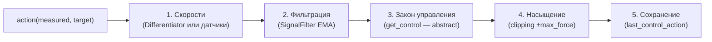

#### Паттерн Strategy

**Где:** Контроллеры (`PIDController`, `PPOController`, `SwingUp`) — различные стратегии управления, взаимозаменяемые через интерфейс `Controller`.

#### Паттерн Composite

**Где:** `SwingUpAndBalance` — композитный контроллер, делегирующий управление либо `SwingUp`, либо `PIDController` в зависимости от состояния.

#### Паттерн Factory Method

**Где:** `PPOController.train()` — внутренняя функция `make_env()` создаёт `PendulumEnv` для обучения и оценки.

#### Паттерн Adapter

**Где:** `PPOController` адаптирует API Stable-Baselines3 (`predict()`) к интерфейсу `Controller.get_control()`.

#### Алгоритм RK4 (Runge–Kutta 4-го порядка)

**Где:** C++ backend, `co_physics.cpp:rk4_step()`

Классический метод RK4 с фиксированным шагом:

$$k_1 = f(t, y), \quad k_2 = f(t + \frac{h}{2}, y + \frac{h}{2} k_1)$$
$$k_3 = f(t + \frac{h}{2}, y + \frac{h}{2} k_2), \quad k_4 = f(t + h, y + h k_3)$$
$$y_{n+1} = y_n + \frac{h}{6}(k_1 + 2k_2 + 2k_3 + k_4)$$

#### Уравнения Лагранжа 2-го рода

**Где:** C++ backend, `co_physics.cpp:compute_ddq()`

$$M(q) \ddot{q} + C(q, \dot{q}) \dot{q} + G(q) = \tau$$

Решение методом Крамера:
- 2×2 для однозвенного режима (`single_mode=True`)
- 3×3 для двухзвенного режима

#### Генетический алгоритм

**Где:** `optimizers.py:Genetic_PID_AngleOnly`

- Турнирный отбор (размер `tournament_k=3`)
- Элитизм (`elite_frac=0.2`)
- Вещественный кроссовер: `child = α·p1 + (1-α)·p2`
- Мутация: гауссова с затухающим σ
- Раннее завершение при стабилизации угла

### 6.2 Важные нюансы

#### Имитация вычислительной задержки

**Где:** `clock_cycle()` и `PendulumEnv.step()`

В реальном контроллере есть задержка между съёмом показаний и выдачей управления. Для имитации:
- `clock_cycle()`: случайная доля `freeze_ratio ∈ [0.2, 0.5]` такта — физика работает с предыдущей силой
- `PendulumEnv.step()`: фиксированная доля `0.2` (20%) — фаза вычисления с `prev_force`

> ⚠️ **Несогласованность:** `clock_cycle` использует случайный `freeze_ratio`, а `PendulumEnv.step` — фиксированный `0.2`. Это разные модели задержки.

#### Предвычисление пула шума

**Где:** `SensorBlock.__init__()`

Шум (2 млн значений × 6 каналов) генерируется один раз при создании. В горячем цикле — только индексация массива. Это исключает вызовы RNG из критического пути.

**Платой:** при `max_steps > 2_000_000` шум повторяется (циклический индекс).

#### Нормализация углов

**Где:** C++ `rk4_step()`

После каждого шага углы нормализуются в `[0, 2π)` через `std::fmod`. Это предотвращает накопление ошибок плавающей точки при длительных симуляциях.

#### Инерционность двигателя (`motor_time_constant`)

##### Физическая суть

В реальном электроприводе управляющая сила не прикладывается к тележке мгновенно — двигатель имеет электромеханическую инерцию. Ток в обмотках нарастает не мгновенно (из-за индуктивности), а ротор имеет механическую инерцию. Это моделируется как **апериодическое звено первого порядка** (first-order lag) с передаточной функцией:

$$W(s) = \frac{F_{actual}(s)}{F_{ideal}(s)} = \frac{1}{\tau s + 1}$$

где:
- `F_ideal` — идеальное управляющее усилие, вычисленное регулятором (Н)
- `F_actual` — реальное усилие на тележке после инерции двигателя (Н)
- `τ = motor_time_constant` — постоянная времени двигателя (с)

##### Параметр `motor_time_constant` в `PlantConfig`

| Поле | Тип | По умолч. | Описание |
|---|---|---|---|
| `motor_time_constant` | `float` | `0.0` | Постоянная времени апериодического звена двигателя (с). `0.0` — мгновенный отклик (инерция отключена) |

**Типичные значения:**
- `0.0` — идеальный двигатель (мгновенный отклик, для отладки/сравнения)
- `0.01`–`0.05` — малая инерция (быстрый сервопривод)
- `0.05`–`0.2` — средняя инерция (обычный DC-двигатель)
- `> 0.2` — большая инерция (тяжёлый привод)

В `main.py` используется `motor_time_constant=0.05` (50 мс) — типичное значение для небольшого DC-привода.

##### Дискретная реализация

Применяется **явная Эйлера** дискретизация непрерывной передаточной функции:

$$F_{k+1} = F_k + (F_{ideal} - F_k) \cdot \frac{dt}{\tau}$$

где `dt` — шаг интегрирования физики (`PlantConfig.dt`, по умолчанию `0.0001` с).

**Псевдокод:**
```python
if motor_tau > 0.0:
    F_actual = motor_force + (F_ideal - motor_force) * (dt / motor_tau)
else:
    F_actual = F_ideal  # мгновенный отклик
motor_force = F_actual  # сохранение состояния для следующего шага
```

##### Где реализовано (три места — ⚠️ дублирование)

| Место | Файл | Используется? | Описание |
|---|---|---|---|
| **C++ backend** | [`co_bindings.cpp`](packages/simulation/CO/cpp/co_bindings.cpp:39) | ✅ **Да** (основной путь) | Внутри `update_physics_cpp()`: `F_actual = motor_force + (F_ideal - motor_force) * (dt / motor_tau)` |
| **`MotorInertia` (Python)** | [`engine.py`](packages/simulation/CO/engine.py:1) | ❌ Нет (мёртвый код) | Отдельный класс с методом `update(target_force, dt)`. Не вызывается в основном потоке |
| **`ObjectOfControl._motor_force`** | [`pendulum.py`](packages/simulation/CO/pendulum.py:211) | ✅ Да (хранение состояния) | Хранит текущее `F_actual` между вызовами C++; передаётся в `update_physics_cpp` и возвращается обратно |

**Фактический поток инерции:**

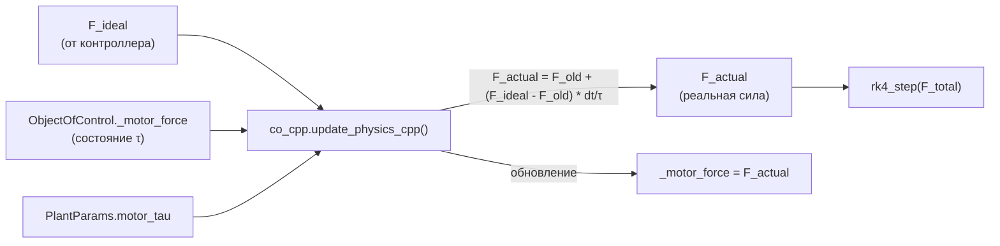

##### Влияние на систему

1. **Запаздывание управления:** Реальная сила отстаёт от идеальной на ~`3τ` (время установления 95%). При `τ=0.05` с — запаздывание ~150 мс. Это критично для стабилизации маятника: регулятор «видит» запаздывание и должен компенсировать его.

2. **Сглаживание:** Инерция действует как ФНЧ для управляющего сигнала — подавляет высокочастотные осцилляции, но вносит фазовое запаздывание. Именно поэтому из `Controller.compute_control` были **удалены** цифровые фильтры `action_filter` и `action_smooth` — физическая инерция двигателя уже выполняет эту роль.

3. **Влияние на обучение RL:** PPO-агент обучается в среде с инерцией, что делает задачу сложнее (нужно учитывать запаздывание). Без инерции (`τ=0`) обучение быстрее, но политика не будет работать на реальном железе.

4. **Взаимодействие с тактом управления:** При `dt_control=0.01` с и `dt_physics=0.0001` с — 100 микрошагов физики на один такт управления. Инерция обновляется на **каждом микрошаге**, поэтому `F_actual` плавно нарастает внутри такта, а не скачкообразно.

##### Пример: отклик на ступенчатое воздействие

При `F_ideal = 24.0` Н (максимальная сила), `τ = 0.05` с, `dt = 0.0001` с:

| Время (с) | F_actual (Н) | % от F_ideal |
|---|---|---|
| 0.000 | 0.00 | 0% |
| 0.005 | 2.20 | 9.2% |
| 0.010 | 4.01 | 16.7% |
| 0.025 | 8.66 | 36.1% |
| 0.050 | 15.17 | 63.2% |
| 0.075 | 19.02 | 79.2% |
| 0.100 | 21.49 | 89.5% |
| 0.150 | 23.68 | 98.7% |
| 0.200 | 23.99 | ~100% |

> 💡 **Время установления** (95% от установившегося значения) ≈ `3τ = 0.15` с. Это означает, что при резком изменении уставки реальная сила достигнет целевого значения за ~150 мс.

##### Доступ к текущему усилию

Текущее реальное усилие на тележке (с учётом инерции) доступно через свойство:

```python
plant = ObjectOfControl(plant_config)
# ... симуляция ...
real_force = plant.motor_force  # float, Н
```

В GUI это значение отображается как «Сила: {applied_force:+.1f} Н» и используется для отрисовки стрелки силы.

##### Deprecated: `Controller.set_motor_inertia()`

Метод `Controller.set_motor_inertia(time_constant)` сохранён для обратной совместимости, но **ничего не делает** — выдаёт `DeprecationWarning`:

```python
def set_motor_inertia(self, time_constant: float) -> None:
    warnings.warn(
        "Motor inertia is now a property of the plant (PlantConfig.motor_time_constant). "
        "set_motor_inertia() is deprecated and does nothing.",
        DeprecationWarning,
        stacklevel=2,
    )
```

Инерционность перенесена из контроллера в объект управления (`PlantConfig.motor_time_constant`), поскольку это **физическое свойство привода**, а не алгоритма управления.

> ⚠️ **Рекомендация по рефакторингу:** Удалить класс `MotorInertia` (мёртвый код) и метод `set_motor_inertia()`. Логика инерции должна жить только в одном месте — C++ backend (или Python-fallback, если будет реализован).

#### Квантование энкодеров

**Где:** `SensorBlock.get_telemetry()`

```python
meas[0] = np.rint(raw_q[0] / cs) * cs   # тележка
meas[1] = np.rint(raw_q[1] / a1) * a1   # энкодер θ₁
meas[2] = np.rint(raw_q[2] / a2) * a2   # энкодер θ₂
```

Шаг квантования: `2π / encoder_resolution` (для 4096 имп./оборот ≈ 0.0015 рад).

### 6.3 Работа с внешними сервисами

#### C++ backend (pybind11)

- **Назначение:** Высокопроизводительное интегрирование уравнений движения
- **Связь:** Через pybind11, in-place обновление numpy-массивов
- **Сборка:** CMake + pybind11, вывод `co_cpp.so` в `packages/simulation/CO/`
- **Fallback:** Отсутствует — `RuntimeError` если модуль не собран

#### ffmpeg (видео)

- **Назначение:** Сборка MP4 из PNG-кадров
- **Вызов:** `subprocess.run(["ffmpeg", "-framerate", fps, "-i", "frame_%06d.png", ...])`
- **Параметры:** `libx264`, `yuv420p`
- **Обработка ошибок:** `try/except` → возврат `None`

#### Stable-Baselines3

- **Назначение:** Алгоритм PPO
- **Связь:** `PPOController` создаёт `SB3_PPO`, вызывает `learn()`, `predict()`, `save()`, `load()`
- **Callback'и:** `CheckpointCallback`, `EvalCallback`, `StopTrainingOnRewardThreshold`

#### TensorBoard

- **Назначение:** Логирование обучения (через SB3 `verbose=1`)
- **Просмотр:** `tensorboard --logdir ./`

#### Файловая система

- **Чекпоинты PPO:** `checkpoints/ppo/` (создаётся автоматически)
- **Лучшие модели:** `checkpoints/ppo/best/`
- **Кадры видео:** temp-директория `pendulum_rec_*`
- **Профили:** `profiling_outputs/*.pstats`
- **Графики PID sweep:** `pid_sweep/` (при использовании `Zigler_Nikols`)

### 6.4 Асинхронность и многопоточность

**В проекте нет явной асинхронности или многопоточности.** Вся симуляция — однопоточная.

- C++ backend использует `thread_local std::mt19937` для RNG (потокобезопасность, но не распараллеливание)
- GUI работает в главном потоке Pygame (блокирующий `while` цикл)
- Обучение PPO использует внутреннюю многопоточность SB3 (через `DummyVecEnv` — однопоточная обёртка)

> 💡 **Потенциал:** Генетический алгоритм `Genetic_PID_AngleOnly` оценивает каждую особь популяции последовательно. Параллельная оценка через `multiprocessing` может значительно ускорить сходимость.

### 6.5 Логирование и мониторинг

| Компонент | Метод | Назначение |
|---|---|---|
| `Logger` (loggers) | `draw_dynamic_plot()` | Matplotlib-график θ(t) в реальном времени |
| SB3 PPO | `verbose=1` | Вывод прогресса обучения в stdout |
| SB3 Callbacks | `CheckpointCallback` | Сохранение чекпоинтов |
| SB3 Callbacks | `EvalCallback` | Оценка и ранняя остановка |
| TensorBoard | (через SB3) | Логирование метрик обучения |
| GUI | HUD + графики | Отображение состояния в реальном времени |
| GUI | CSV-буферы | Накопление данных (но `_save_csv()` — заглушка) |
| GA | `print()` | Прогресс поколений в stdout |
| Profiling | cProfile + pstats | Профилирование производительности |

> ⚠️ **Проблема:** `PendulumViewer._save_csv()` — пустая заглушка. CSV-данные накапливаются в памяти, но не сохраняются.

---

## 7. Настройка и запуск

### 7.1 Переменные окружения

Проект **не использует** переменные окружения напрямую. Все настройки передаются через Python-конфигурации (dataclass'ы).

Косвенные переменные:
- `PATH` — должен содержать `ffmpeg` для сборки видео
- `PYTHONPATH` — при запуске скриптов из `profiling/` добавляется корень проекта

### 7.2 Зависимости

#### Основные зависимости (из корневого `pyproject.toml`)

```toml
[tool.poetry.dependencies]
python = "^3.12"
numpy = "^2.4.6"
matplotlib = "^3.10.9"
pygame = "^2.6.1"
scipy = "^1.17.1"
numba = "^0.65.1"
ffmpeg = "^1.4"
pybind11 = "^3.0.4"
scikit-optimize = "^0.10.2"
tqdm = "^4.68.3"
statsmodels = "^0.14.6"
torch = {version = "^2.13.0", source = "pytorch_cpu"}
tensorboard = "^2.21.0"
gymnasium = "^1.3.0"

# Локальные подмодули
co = {path = "packages/simulation/CO", develop = true}
pid = {path = "packages/controllers/PID", develop = true}
gui = {path = "packages/simulation/GUI", develop = true}
profiling = {path = "profiling", develop = true}
loggers = {path = "packages/loggers", develop = true}
reinforce = {path = "packages/controllers/REINFORCE", develop = true}
custom = {path = "packages/controllers/custom", develop = true}
ppo = {path = "packages/controllers/PPO", develop = true}

[tool.poetry.group.dev.dependencies]
mlflow = "^3.13.0"
ipykernel = "^7.3.0"
```

#### Источники пакетов

```toml
[[tool.poetry.source]]
name = "pytorch_cpu"
url = "https://download.pytorch.org/whl/cpu"
priority = "explicit"
```

> ⚠️ **Дублирование:** В `pyproject.toml` определены **два** источника с именами `pytorch-cpu` и `pytorch_cpu` (разный регистр/подчёркивание). Это может вызвать предупреждения Poetry.

### 7.3 Команды для установки, настройки, запуска

#### Установка зависимостей

```bash
# Установка всех зависимостей через Poetry
poetry install

# Установка dev-зависимостей (mlflow, ipykernel)
poetry install --with dev
```

#### Сборка C++ backend (обязательно для симуляции)

```bash
# Из корня проекта
cd packages/simulation/CO/cpp
rm -rf build
mkdir build && cd build

# Конфигурация с Python из poetry-окружения
cmake .. \
  -DPython_EXECUTABLE="$(poetry run python -c 'import sys; print(sys.executable)')" \
  -DCMAKE_BUILD_TYPE=Release

# Сборка
cmake --build . -j "$(nproc)"

# Проверка
poetry run python -c "
from packages.simulation.CO import co_cpp as m
print('C++ backend OK:', m)
print('Functions:', [f for f in dir(m) if not f.startswith('_')])
"
```

#### Запуск основной симуляции

```bash
# Обучение PPO + запуск GUI
poetry run python main.py
```

#### Профилирование

```bash
# Профилирование PendulumEnv
poetry run python profiling/profiling.py

# Профилирование обучения REINFORCE
poetry run python profiling/profile_reinforce_train.py
```

#### Просмотр TensorBoard

```bash
tensorboard --logdir ./
```

### 7.4 Примеры конфигурационных файлов

#### Основная конфигурация (из `main.py`)

```python
import numpy as np
from packages.controllers.PPO import PPOConfig, PPOController
from packages.simulation.CO import (
    ControllerConfig, NoiseForce, PlantConfig, SensorConfig,
)

# Физическая модель
PLANT_CONFIG = PlantConfig(
    M=1.0,           # масса тележки (кг)
    m1=0.1,          # масса маятника (кг)
    l1=0.3,          # длина маятника (м)
    m2=0.0,          # второе звено выключено
    l2=0.0,
    g=-9.81,         # гравитация (м/с²)
    b_c=0.1,         # трение тележки
    b_1=0.003,       # трение шарнира
    b_2=0.003,
    single_pendulum_mode=True,
    backslash_mode=False,
    init_q=np.array([0.0, np.pi, 0.0]),   # маятник вертикально
    init_dq=np.array([0.0, 0.0, 0.0]),     # нулевые скорости
    dt=0.0001,                            # шаг физики (с)
    motor_time_constant=0.05,             # инерция двигателя (с)
)

# Датчики
SENSOR_CONFIG = SensorConfig(
    encoder_resolution_1=4096,
    encoder_resolution_2=4096,
    cart_sensor_resolution=0.0001,
    noise_std_q=(0.0005, 0.002, 0.002),
    noise_std_dq=(0.005, 0.01, 0.01),
)

# Регулятор
CONTROLLER_CONFIG = ControllerConfig(
    dt=0.01,              # такт управления (100 Гц)
    max_force=24.0,      # максимальная сила (Н)
    has_velocity_sensors=False,
    filter_cutoff_hz=50.0,
)

# Внешнее возмущение
NOISE = NoiseForce(mean=0.00, std=0.03)

# Целевое состояние [x, θ₁, θ₂, ẋ, θ̇₁, θ̇₂]
TARGET = np.array([0.0, np.pi, 0.0, 0.0, 0.0, 0.0])

# PPO гиперпараметры
ppo_config = PPOConfig(
    total_timesteps=1_000_000,
    n_steps=1024,
)
```

#### Конфигурация для профилирования

```python
# profiling/profiling.py
plant_cfg = PlantConfig(
    M=1.0, m1=0.1, l1=0.3, m2=0.1, l2=0.3,
    g=-9.81, b_c=0.1, b_1=0.003, b_2=0.003,
    single_pendulum_mode=True,
    dt=0.0001,
)
sensor_cfg = SensorConfig(
    encoder_resolution_1=4096,
    encoder_resolution_2=4096,
    cart_sensor_resolution=0.0001,
    noise_std_q=(0.0005, 0.002, 0.002),
    noise_std_dq=(0.005, 0.01, 0.01),
)
noise = NoiseForce(mean=0.0, std=0.03)
target = np.array([0.0, np.pi, 0.0, 0.0, 0.0, 0.0])
```

---

## 8. Анализ: сложные места, архитектурные решения, рефакторинг

### 8.1 Три самых сложных/запутанных места в коде

#### 1. Несоответствие API контроллеров (`get_control` vs `get_action` vs `compute_control`)

**Проблема:** В коде существует три разных названия для метода закона управления:
- `Controller.action()` — Template Method (текущий)
- `Controller.get_control()` — абстрактный метод (текущий)
- `clock_cycle()` вызывает `controller.compute_control()` — **не существует** в текущем `Controller`
- `SwingUp` и `SwingUpAndBalance` переопределяют `get_action()` — **не существует** в текущем `Controller`

**Следствие:** `clock_cycle()` несовместим с текущим `Controller`. `SwingUp`/`SwingUpAndBalance` нельзя инстанцировать (не реализуют абстрактный `get_control`). Это делает PID-оптимизацию (через `clock_cycle`) и SwingUp-контроллеры **неработоспособными** с текущим API.

**Файлы:** [`controller.py`](packages/simulation/CO/controller.py:310), [`run.py`](packages/simulation/CO/run.py:97), [`swing_up_block.py`](packages/controllers/custom/swing_up_block.py:18)

#### 2. Дублирование логики инерции двигателя в трёх местах

**Проблема:** Модель инерционности двигателя (апериодическое звено) реализована:
1. `MotorInertia` (Python, `engine.py`) — **не используется** в основном потоке
2. `ObjectOfControl._motor_force` (Python, через C++ backend) — используется
3. `co_bindings.cpp` (C++, внутри `update_physics_cpp`) — **фактически работает**

**Следствие:** `MotorInertia` — мёртвый код. Логика инерции размазана между Python и C++, что усложняет понимание и модификацию. `Controller.set_motor_inertia()` — deprecated, но всё ещё присутствует.

#### 3. Два разных механизма тактирования (`clock_cycle` vs `PendulumEnv.step`)

**Проблема:** Существует два независимых способа выполнить такт управления:
- `clock_cycle()` — для PID/GA (случайный `freeze_ratio`, вызывает `compute_control`)
- `PendulumEnv.step()` — для PPO/RL (фиксированный 20%, вызывает `controller.action`)

**Следствие:** Разная модель задержки, разный API, разная логика награды. Код дублируется. При изменении логики тактирования нужно править два места. `PendulumEnv` не использует `clock_cycle`, хотя мог бы.

### 8.2 Архитектурные решения, вызывающие вопросы

#### 1. Обязательность C++ backend без Python-fallback

**Решение:** `ObjectOfControl.update_physics()` вызывает `raise RuntimeError` если `co_cpp` недоступен. Python-реализация RK4 отсутствует.

**Вопрос:** Почему нет NumPy-fallback? Это делает проект непереносимым на системы без компилятора C++. Для отладки и прототипирования Python-версия была бы полезна.

#### 2. `PendulumEnv` хранит ссылку на `Controller`, но не использует его в `step()`

**Решение:** `PendulumEnv.__init__` принимает `controller` и хранит как `self._controller`, но в `step()` управление приходит извне (от RL-агента). Контроллер используется только в GUI (`viewer.use()` вызывает `controller.action()`).

**Вопрос:** Смешение ответственности — `PendulumEnv` одновременно и Gym-среда (где агент выдаёт действие), и обёртка для контроллера (где контроллер вычисляет действие). Это нарушает принцип единой ответственности.

#### 3. `loggers/__init__.py` — пустой

**Решение:** Пакет `loggers` не экспортирует `Logger` из `__init__.py`. При этом контроллеры импортируют `from loggers import Logger`.

**Вопрос:** Это вызовет `ImportError`. Либо нужен `from .loggers import Logger` в `__init__.py`, либо импорт должен быть `from loggers.loggers import Logger`.

#### 4. Дублирование источников PyTorch в `pyproject.toml`

**Решение:** Определены два источника: `pytorch-cpu` и `pytorch_cpu` (с разным написанием).

**Вопрос:** Это может вызвать предупреждения Poetry или конфликты. Нужно оставить один.

#### 5. `Renderer`, `PhysicsRunner`, `Recorder` — неиспользуемые обёртки

**Решение:** В пакете GUI есть классы `Renderer`, `PhysicsRunner`, `Recorder`, которые **не используются** в основном потоке `PendulumViewer`. Их функциональность дублируется методами `PendulumViewer`.

**Вопрос:** Это либо незавершённый рефакторинг (вынос логики в отдельные классы), либо мёртвый код. Нужно либо завершить рефакторинг, либо удалить.

### 8.3 Что можно было бы улучшить (рефакторинг)

#### Приоритет 1: Критические исправления

1. **Унифицировать API контроллеров:** Переименовать `get_control` → `get_action` (или наоборот) во всём проекте. Заставить `clock_cycle` вызывать `controller.action()` вместо `compute_control()`. Заставить `SwingUp`/`SwingUpAndBalance` переопределять правильный метод.

2. **Исправить `loggers/__init__.py`:** Добавить `from .loggers import Logger`.

3. **Исправить `profiling/profiling.py`:** Убрать параметр `dt_control=0.005` из вызова `PendulumEnv()` (не существует в сигнатуре).

4. **Исправить баг в `SwingUp.get_action()`:** Удалить недостижимый `if/else` с `return 40`/`return -40` после вычисления `F`.

#### Приоритет 2: Архитектурные улучшения

5. **Унифицировать тактирование:** Сделать `PendulumEnv.step()` использовать `clock_cycle()` (или наоборот), чтобы устранить дублирование логики задержки.

6. **Разделить ответственность `PendulumEnv`:** Либо `PendulumEnv` — чистая Gym-среда (действие от агента), либо — обёртка для контроллера (действие от `controller.action()`). Не обе роли одновременно.

7. **Удалить `MotorInertia` (или использовать):** Если инерция обрабатывается в C++, удалить Python-класс `MotorInertia` и deprecated `set_motor_inertia()`.

8. **Реализовать Python-fallback для RK4:** NumPy-версия уравнений Лагранжа + RK4 для переносимости и отладки.

9. **Удалить неиспользуемые классы GUI:** `Renderer`, `PhysicsRunner`, `Recorder` — либо завершить рефакторинг (вынести логику из `PendulumViewer`), либо удалить.

#### Приоритет 3: Оптимизация производительности

10. **Устранить копии массивов:** `ObjectOfControl.q` и `.dq` возвращают `.copy()` на каждом обращении. В горячем цикле — до 5 копий на такт. Использовать in-place буферы или `return self._q` с гарантией неизменности.

11. **Вынести `pool_size` в `SensorConfig`:** Захардкоженный 2 млн — сделать параметром.

12. **Параллелизация GA:** Оценка популяции в `Genetic_PID_AngleOnly` — через `multiprocessing.Pool`.

13. **Объединить EMA-фильтры:** `Differentiator` и `SignalFilter` — два последовательных EMA. Можно объединить в один проход.

14. **Предвычислить `dt/tau`:** В `MotorInertia.update()` деление `dt/tau` вычисляется на каждом шаге — предвычислить в `__init__`.

#### Приоритет 4: Качество кода

15. **Завершить REINFORCE:** Реализовать методы (сейчас — заглушки `...`).

16. **Реализовать DDPG:** Файл `ddpg.py` — пустой.

17. **Завершить CSV-логирование:** `PendulumViewer._save_csv()` — пустая заглушка.

18. **Добавить типизацию:** `Logger` не имеет type hints. `SwingUp`/`SwingUpAndBalance` — минимальная типизация.

19. **Удалить дублирование источников PyTorch:** Оставить один `pytorch_cpu` в `pyproject.toml`.

20. **Добавить тесты:** В проекте нет тестов. Нужны unit-тесты для `Differentiator`, `SignalFilter`, `SensorBlock`, `PIDController.get_control`, `PendulumEnv.step`.

---

> 📌 **Итог:** Проект представляет собой амбициозную симуляцию cart-pole с поддержкой множества контроллеров (PID, PPO, REINFORCE, SwingUp) и визуализацией. Архитектура модульная, но страдает от незавершённого рефакторинга (несоответствие API, дублирование логики, мёртвый код). Критические проблемы — несовместимость `clock_cycle` с `Controller`, пустой `loggers/__init__.py`, и баг в `SwingUp`. Приоритет — унификация API и завершение начатых рефакторингов.
